# OCVTS — Documentazione del Repository

> Documentazione del sistema OCVTS (Osservatorio Cardiovascolare del Friuli Venezia
> Giulia). Il documento è organizzato in tre parti, con vista **top‑down** (dal generale
> al particolare):
> **Introduzione** (cos'è il repository, le fonti, i livelli dati, i protocolli) ·
> **Builders** (come dai dati grezzi L0 si costruiscono le aggregazioni L1–L2) ·
> **Datamart** (come le variabili L0–L4 diventano le colonne che vedete nella coorte).
>
> I flussi sono ricostruiti **staticamente** dalla pipeline di lineage (senza accesso al
> server SAS). Dove la ricetta non è catturabile staticamente è indicato con una nota
> **⚠︎ Limite**. Ogni capitolo dei builder e del datamart apre con un **diagramma di
> flusso** semplificato (nomi leggibili, filtri sintetizzati, colori per livello).

## Sommario

- [Introduzione](#introduzione)
  - [Il RER](#il-rer)
  - [I dati e i livelli L0–L4](#i-dati-e-i-livelli-l0l4)
  - [I protocolli](#i-protocolli)
  - [Le variabili standard](#le-variabili-standard)
  - [Obiettivi dell'OCVTS](#obiettivi-dellocvts)
  - [Profondità temporale delle tabelle](#profondità-temporale-delle-tabelle)
  - [Come leggere i diagrammi](#come-leggere-i-diagrammi)
  - [La regola della diagnosi integrata](#la-regola-della-diagnosi-integrata)
- [Builders](#builders)
  - [SDO — builder A01](#sdo--builder-a01)
  - [Diagnosi C@rdioNet — builder A02](#diagnosi-crdionet--builder-a02)
  - [Diagnosi aggregate — builder A03](#diagnosi-aggregate--builder-a03)
  - [Esami di laboratorio — builder B0](#esami-di-laboratorio--builder-b0)
  - [Farmaceutica territoriale — builder FARMATERR](#farmaceutica-territoriale--builder-farmaterr)
  - [Dizionari costruiti](#dizionari-costruiti)
  - [Builder delle diagnosi integrate — D01](#builder-delle-diagnosi-integrate--d01)
- [Datamart](#datamart)
  - [Diagnosi](#diagnosi)
    - [IRC](#irc)
    - [Diabete](#diabete)
    - [Scompenso](#scompenso)
    - [BPCO](#bpco)
    - [COVID](#covid)
    - [Fibrillazione atriale](#fibrillazione-atriale)
    - [Ipertensione](#ipertensione)
    - [Dislipidemia](#dislipidemia)
    - [Anemia](#anemia)
    - [Rischio CVMA](#rischio-cvma)
    - [Ipercolesterolemia familiare](#ipercolesterolemia-familiare)
    - [Microalbuminuria](#microalbuminuria)
    - [Obesità](#obesità)
    - [Dialisi](#dialisi)
  - [Esami](#esami)
    - [Laboratorio](#laboratorio)
    - [ECO ed ECG](#eco-ed-ecg)
    - [Spirometrie](#spirometrie)
    - [Fenotipo](#fenotipo)
    - [Parametri funzionali](#parametri-funzionali)
  - [Eventi](#eventi)
    - [MALE](#male)
    - [MACE 3p e 5p](#mace-3p-e-5p)
    - [Eventi di ricovero](#eventi-di-ricovero)
    - [Emorragie maggiori](#emorragie-maggiori)
  - [Prestazioni](#prestazioni)
  - [Score](#score)
    - [SCORE2 e SCORE2-OP](#score2-e-score2-op)
    - [SCOREC](#scorec)
    - [Charlson](#charlson)
    - [ESC](#esc)
    - [Classi di rischio cardiovascolare](#classi-di-rischio-cardiovascolare)
  - [Terapia](#terapia)
    - [Terapia farmaceutica](#terapia-farmaceutica)
    - [Terapia C@rdioNet](#terapia-crdionet)
  - [Le due viste del datamart](#le-due-viste-del-datamart)
- [Note di copertura](#note-di-copertura)
---

## Introduzione

---

### Il RER

Il Repository Epidemiologico Regionale (RER) è un data warehouse gestito da Insiel S.p.A.
su mandato dell'ARCSS. Al suo interno non sono presenti dati che consentano
l'identificazione diretta degli individui: ogni sei mesi viene generata una nuova
`key_anagrafe`, una chiave pseudonimizzata che identifica univocamente ciascun soggetto.

Nel RER confluiscono numerose fonti dati, prevalentemente amministrative ma anche alcune
cliniche verticali, attraverso un articolato processo ETL e successivi controlli di
consistenza. Un elemento distintivo del sistema del Friuli Venezia Giulia (FVG) è la
presenza nel RER dei risultati degli esami di laboratorio eseguiti presso i laboratori
pubblici della Regione (DNLAB).

La profondità temporale dei dati varia a seconda del flusso informativo: le SDO risalgono
fino al 1985, mentre le anagrafiche contengono dati anche anteriori. Altri flussi hanno
profondità inferiori: i dati di laboratorio sono disponibili dal 2009, la farmaceutica
convenzionata dal 1995, il CUP dal 2013 e il PS dal 2000.

Oltre ai flussi amministrativi, il RER include fonti cliniche come **C@rdioNet**, un
software gestionale verticale che rappresenta la cartella clinica cardiologica, compilata
dai cardiologi e dal personale infermieristico a ogni contatto con il paziente a partire
dal 2010. Nel RER la cartella C@rdioNet è suddivisa in **13 tabelle**, prive di chiavi
esterne di collegamento: tutte sono unite esclusivamente mediante la `key_anagrafe`.
Questo implica che, per caratterizzare un individuo in un determinato momento, è
necessario definire regole temporali per correlare le informazioni provenienti dalle
diverse tabelle.

---

### I dati e i livelli L0–L4

I dataset impiegati per le analisi sono il risultato di un processo di costruzione di
variabili a partire dai dati grezzi del RER, organizzati in livelli progressivi di
raffinatezza.

**L0 — dati originari del RER.** Tabelle direttamente accessibili nel RER, derivate dai
flussi amministrativi e clinici dopo l'ETL di Insiel. Elenco non esaustivo:

* Anagrafica (anagrafe generale, nascite, decessi, genitori, residenze, domicili)
* Ricoveri ospedalieri (schede di dimissione ospedaliera, SDO)
* ADI (assistenza domiciliare integrata), PIC, RSA
* Esenzioni
* Farmaceutica territoriale; farmaceutica ospedaliera e diretta[^1]
* PS (pronto soccorso), anatomia patologica (SNOMED)
* CUP (prenotazioni), prestazioni ambulatoriali
* DNLAB (esami di laboratorio — solo laboratori pubblici FVG)
* C@rdioNet (13 tabelle cliniche unite tramite `key_anagrafe`)

**L1 — prima aggregazione.**
- **DNLAB:** aggregazione dei codici che identificano lo stesso esame (es. emoglobina
  glicata: HBGL%, HBGL, HBA1C, A1C, …).
- **FARMA:** codifica in classi farmacologiche degli ATC.
- **SDODIA:** classificazione dei ricoveri secondo i codici ICD‑9.
- **CARDIA:** classificazione delle diagnosi C@rdioNet per descrizione, sede e gravità.

**L2 — aggregazione intermedia.**
- **DIAGG:** aggregazione di diagnosi tra SDODIA e CARDIA.
- **LABUNI:** unificazione dei dati di laboratorio tra DNLAB e referti C@rdioNet.
- **EVENTI:** identificazione di eventi complessi (es. MACE 3p/5p, MALE) combinando L1 e L0.

**L3 — diagnosi integrate (DIAINT).** Diagnosi integrate da fonti L0/L1/L2 (es. diabete
integrato definito dalla data minima tra esenzione, emoglobina glicata elevata,
prescrizioni farmacologiche e diagnosi aggregata).

**L4 — classificazione avanzata (CLRCV).** Classi di rischio cardiovascolare e score.

Alcune variabili sono precostituite e disponibili indipendentemente dalla coorte; altre,
come le diagnosi integrate, sono costruite **solo per la coorte** in esame — un
compromesso tra spazio nel RER e tempi di calcolo (es. l'etichettatura dei ricoveri
richiede ~6 ore in versione non parallelizzata).

---

### I protocolli

Esistono tre prototipi di studio, chiamati protocolli:

* **CLINICO** — studi clinici con una coorte ben definita (unità statistica = persona,
  evento o esame). La definizione della coorte è fase fondamentale e non standardizzabile:
  richiede la collaborazione tra programmatore SAS e referente clinico per tradurre i
  criteri di inclusione/esclusione nel linguaggio del RER.
* **PDTA** — attinente ai 3 PDTA SCC, BPCO, DIABETE (unità statistica = persone affette,
  ripetute su tutti gli anni di indagine).
* **EPI4M** — una via di mezzo tra clinico e PDTA sulle tre patologie.

Definita la coorte, si aggiungono le variabili di follow‑up per la valutazione degli
outcome. Le variabili L1–L4 possono essere aggiunte in modo semi‑automatico: il ricercatore
seleziona, tramite un foglio Excel strutturato, quali variabili includere, come
rinominarle e in che ordine disporle nel datamart finale.

---

### Le variabili standard

Classi di variabili già pronte. Per i protocolli PDTA ed EPI4M la selezione è fissa; per
il protocollo CLINICO il referente sceglie cosa trattenere.

* **diagnosi** — diagnosi aggregate; integrate: anemia, BPCO, ipercolesterolemia
  familiare, COVID, diabete, dislipidemia, FA, ipertensione, IRC, microalbuminuria,
  obesità, RCVMA, scompenso, dialisi
* **esami strumentali** — ECG, ECO, spirometrie, parametri funzionali, fenotipo, laboratorio
* **eventi** — MALE, MACE 3P/5P, eventi di ospedalizzazione, emorragie maggiori
* **prestazioni** — CUP (altro, ECG, ECO, ecovasco, ecocardio, tutte, spiro, visite),
  prestazioni C@rdioNet, pronto soccorso
* **score** — Charlson, ESC, SCORE2, SCOREC, classi di rischio cardiovascolare
* **terapia** — farmaceutica, terapia C@rdioNet

---

### Obiettivi dell'OCVTS

- Definizione di **coorti epidemiologiche** nella popolazione del FVG per analizzare
  caratteristiche, prognosi, aderenza terapeutica, effetti dei trattamenti, fattori
  prognostici/predittivi.
- Valutazione dei **percorsi assistenziali** di specifiche categorie di pazienti, per
  verificare il rispetto degli standard di cura (farmaci, dispositivi, prestazioni, setting).
- **Integrazione sistematica** di fonti eterogenee, incluse quelle non strutturate (segnali
  ECG, immagini ecocardiografiche), per arricchire i fattori prognostici e migliorare la
  stratificazione del rischio.

---

### Profondità temporale delle tabelle

|  | Livello 0 | Livello 1 | Livello 2 | Livello 3 |
| :---- | :---- | :---- | :---- | :---- |
| DNLAB | 2009 | MAX |  |  |
| PNLAB[^2] | 2010–2016 | MAX |  |  |
| SDO | 1986 | MAX |  |  |
| FARMA TERR. | 1995 | MAX |  |  |
| AMBULATORIALE[^3] | 1998 |  |  | 2000 |

I missing significano che, se c'è un flusso a quel livello, usa la profondità del livello
precedente. Le **esenzioni** non sono aggregate per anno: la data minima di apertura di
un'esenzione è il 1/1/1900. La tabella **DIAGNOSI** di C@rdioNet è una monotabella (data di
creazione 1/1/1960, insignificante); come per le esenzioni, la data di prima apertura di
una diagnosi è il 1/1/1900 (nei documenti si indica convenzionalmente 1/11/2009).

---

### Come leggere i diagrammi

I diagrammi usano una palette unica. Le **tabelle** sono rettangoli/cilindri colorati per
livello; le **trasformazioni** (DATA step / PROC) sono esagoni grigi `{{…}}` con dentro la
sintesi dei filtri; le **finestre temporali** sono etichette sugli archi. I nomi
coorte‑specifici sono scritti senza il prefisso `&nome.` (es. `integrata_irc`).

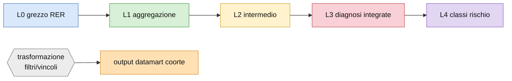

| Colore | Livello | Significato |
|---|---|---|
| azzurro | **L0** | grezzo RER (`DWTSISSR.v*`), semi del grafo |
| verde | **L1** | prima aggregazione (esami, classi ATC, SDO, cardionet) |
| giallo | **L2** | intermedio (diagnosi aggregate, laboratorio unito, eventi) |
| rosa | **L3** | diagnosi integrate (data minima tra fonti) |
| viola | **L4** | classi di rischio / score |
| grigio | trasf. | DATA step / PROC (esagono, con i filtri) |
| arancio | output | variabile finale nel datamart della coorte |

---

### La regola della diagnosi integrata

Prima di scendere nelle singole patologie conviene fissare il **pattern comune** che ogni
diagnosi integrata istanzia. Una diagnosi integrata stabilisce **se** e **da quando** un
soggetto è affetto da una patologia, incrociando fonti eterogenee che parlano della stessa
condizione:

- **esenzioni** (il soggetto ha un'esenzione per quella patologia);
- **esami di laboratorio** (un marcatore fuori range: GFR basso per l'IRC, emoglobina
  glicata alta per il diabete, …);
- **prescrizioni farmaceutiche** (terapia cronica coerente con la patologia);
- **diagnosi aggregate** da ricovero (SDO/ICD‑9) e da C@rdioNet.

Ogni fonte, quando presente, porta una **data di prima evidenza**. Il flusso fa il merge
delle fonti per `key_anagrafe` e calcola `data_integrata_<patologia> = min(date delle
fonti)`, più una variabile `<patologia>_from` che registra da quale fonte proviene quella
data minima. Il soggetto è considerato affetto se la data integrata è valida (`> 0`). La
sezione [BPCO](#bpco) è l'esempio esteso con tutti i dataset intermedi.

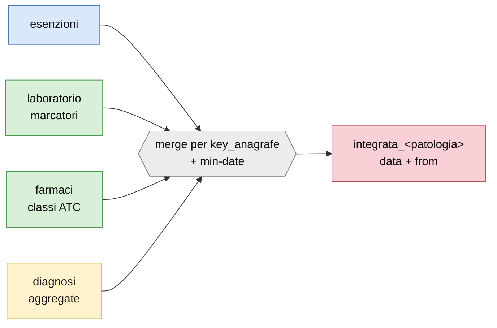

---

## Builders

Un **builder** trasforma il grezzo RER (L0) in tabelle di servizio di livello L1–L2,
riusabili da tutti gli studi. A differenza del datamart, i builder **non dipendono dalla
coorte**: producono tabelle "master" (in `EGTASK`, `ESAMI`, `SDO`, `DIZ`) che la produzione
poi taglia sulla coorte specifica. Rispondono alla domanda dell'utente: *"perché nel
datamart c'è solo la farmaceutica?"* — no: i builder sono molti, uno per famiglia di dati.

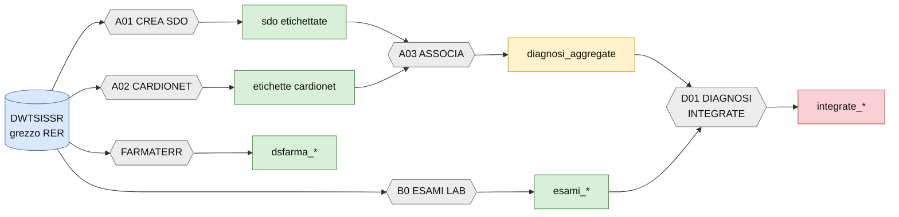

---

### SDO — builder A01

**Definizione.** Etichetta ogni ricovero (SDO) con le categorie diagnostiche ICD‑9
rilevanti, secondo il dizionario `DIZIONARIO.xlsx` (foglio ICD9).

**Fonti in ingresso.** `DWTSISSR.vfp_ricoveri_sdo_` (ricoveri per anno),
`vanagrafe_dati_individuali` e i dizionari SDO (`vdizionario_attributi_sdo`,
`vdizionario_drg`, `vdizionario_strutture`, `vdizionario_territorio`).

**Rami di elaborazione.** Ogni **etichetta** del dizionario è di due tipi:
- **pura** — una lista di codici ICD‑9, distinti in **diagnostici** (`D…`) e **interventi**
  (`I…`), es. `ICD9_CM_BPCO = D490,D491,D492,D494,D496`. Il flag `DIAGNOSIN` decide se
  cercare il codice solo nella **prima** diagnosi del ricovero o in **tutte e sei**.
- **derivata** — una regola logica su altre etichette interne (`zzz_*`), es.
  `ICD9_CM_DM_NEUROPATIADM = 1 se (zzz_D2506 e zzz_NEUROPLUS)`. L'ordine di costruzione è
  dato dalla colonna `ORDER`.

**Output.** `egtask.sdo_generica`, `egtask.sdo_etichettate` e le versioni partizionate
`sdo.sdo_single1..10` (per parallelizzare l'etichettatura).

---

### Diagnosi C@rdioNet — builder A02

**Definizione.** Classifica le diagnosi della cartella cardiologica per **descrizione,
sede e gravità**.

**Fonti.** `DWTSISSR.vfp_cardio_diagnosi` (+ `vfp_cardio_visita` per l'aggancio temporale).
C@rdioNet è una monotabella senza chiavi esterne: l'unico legame è la `key_anagrafe`.

**Rami.** Ogni etichetta cardionet è un insieme di **triplette** descrizione/sede/gravità
(foglio CARDIO di `DIZIONARIO.xlsx`), es. "OBESITÀ" con gradi lieve/moderato/severo.

**Output.** `egtask.etichette_cardionet`.

---

### Diagnosi aggregate — builder A03

**Definizione.** Unisce le etichette SDO (parte ricoveri) e le diagnosi C@rdioNet (parte
clinica) in un'unica **diagnosi aggregata** `diag_*` di livello L2 — il passaggio che
"chiude" una diagnosi da fonti amministrative + cliniche.

**Rami.** L'aggancio avviene per **lettera**: nel dizionario la cella `ICD9_<X>*lettera`
collega l'etichetta SDO alla colonna della diagnosi cardionet con quella lettera.
Un'etichetta con flag di associazione cardiologica diventa una diagnosi aggregata; le
aggregate sono **circa 110** (es. `diag_CM_BPCO`, `diag_CM_IRC`, `diag_CM_DM`,
`diag_CM_ANEMIA`).

**Output.** `egtask.diagnosi_aggregate` — l'input citato da tutte le diagnosi integrate.

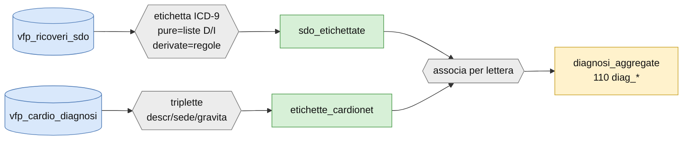

---

### Esami di laboratorio — builder B0

**Definizione.** Aggrega i molti codici DNLAB che identificano lo **stesso esame** in una
sola categoria, unendo dove serve anche il laboratorio estratto da C@rdioNet. Formalmente
L1, ma alcuni esami subiscono post‑processing (conversione unità, calcoli). Gli esami sono
**38**.

**Fonti.** `DWTSISSR.vfp_dnlab_risultati_` (risultati per anno), `vdizionario_dnlab_analisi`
(mappa codice→esame), `vfp_cardio_esame_lab` (laboratorio C@rdioNet).

**Rami.** Un loop **data‑driven** sul dizionario `ESAMI_LABORATORIO`: per ogni esame, la
macro `ACCODALAB` accoda anno per anno i risultati, filtrando `key_anagrafe ≠ 0`, l'esame
richiesto e i risultati non mancanti. Tre livelli di lavorazione: aggregazione semplice;
conversione di unità di misura; esami multi‑fase o già uniti al laboratorio C@rdioNet.

**Output.** `esami.esami_<esame>` (uno per esame) + il registro master `ESAMI.ESAMI`. Gli
esami includono: `acr, aer, pcr, per, malbu, protu, creatinina, gfr, emoglobina, hbglicata,
glicemia, col, hdl, ldl, tri, bnp, probnp, albumina, calcio, fosforo, potassio, sodio, urea,
uricemia, ferritina, ferro, transferrina, got, gpt, tsh, troponinaHS, ematocrito, …`.

---

### Farmaceutica territoriale — builder FARMATERR

**Definizione.** Codifica **1705 codici ATC** in **62 classi** non mutuamente esclusive
(lo stesso ATC può appartenere a più classi), raggruppate per dimensione della tabella
finale in **13 macro‑classi** (`DSFARMA_<ACRONIMO>`). La profondità è massima (dal 1995),
senza filtri.

| Macro classe | Descrizione |
| ----- | ----- |
| ACP | Agenti Cardiovascolari Primari |
| ACSGS | Agenti Cardiovascolari Secondari e Gestionali del Sangue |
| AMA | Agenti Metabolici / Antidiabetici |
| AIA | Agenti Immunomodulatori e Antinfiammatori |
| AAA | Agenti Anti‑infezione e Antiallergici |
| AS | Altri Sistemi (pelle, occhi, sistema nervoso, ecc.) |
| AAD | Altri Agenti Diversi |
| BPCO | Broncopneumopatia Cronica Ostruttiva |
| DIABETE | Diabete Mellito |
| DM1 | Diabete Mellito tipo 1 |
| IPERTENSIONE | Ipertensione Arteriosa |
| IPOLIPEMIZZANTI | Agenti Ipolipemizzanti |
| SCC | Scompenso cardiaco |

Le tabelle sono in `EGTASK` con nome standard `DSFARMA_<ACRONIMO>` (dizionario
farmaceutica: `farma_aggregata`). Ogni tabella L1 è generata eseguendo da console lo
stesso progetto, variando solo la macroclasse da costruire. Colonne in output:

1. **KEY_ANAGRAFE** — identificativo del paziente (num)
2. **data_prestazione** — data di erogazione (date)
3. **CLASSE** — classe farmacologica (char)
4. **farmaco** — nome del farmaco (char)
5. **FARMACO_ATC_COD** — codice ATC (char)
6. **FARMAPRESCR_PEZZI** — numero di pezzi comprati (num)
7. **costo** — costo in euro (num)
8. **FARMACI_DDD_GIORNI** — Defined Daily Dose (char)
9. **FARMACI_DESC** — descrizione estesa (char)
10. **FARMACI_SOSTANZA** — codifica di supporto interna (char)
11. **copertura** — giorni di copertura = pezzi × DDD (num)
12. **anno_prestazione** — anno di erogazione (num)

---

### Dizionari costruiti

Tabelle di reference L1 costruite dai builder e usate a valle (selezioni, codifiche):
`diz.selezione_prestazioni`, `diz.statine_dosaggi`, `diz.tabella_codifica_esami`,
`diz.ESAMI_LABORATORIO` (il dizionario che guida il loop degli esami). Sono lette, mai
prodotte dalla produzione.

---

### Builder delle diagnosi integrate — D01

**Definizione.** Versione "builder" (non coorte‑specifica) delle diagnosi integrate,
prodotta come tabella master in `EGTASK`: `egtask.diagnosi_integrate`, `integrate_bpco`,
`integrate_diabetici`, `integrate_rcvma`, `integrate_scc`. La logica è la stessa del
datamart (data minima tra fonti), applicata all'intera popolazione anziché alla coorte.

> ⚠︎ **Limite.** La maggior parte delle diagnosi integrate è costruita **solo per la
> coorte** (capitolo Datamart): D01 materializza la versione master solo per alcune patologie.

---

## Datamart

Il datamart monta, **sulla coorte** di un singolo studio, le variabili finali selezionate
dal referente clinico tramite un foglio Excel. Ogni unità di produzione (EGP) legge le
tabelle master dei builder + il grezzo RER e produce un output coorte‑specifico
`libout.&nome._<x>`. Le sei famiglie: **diagnosi, esami, eventi, prestazioni, score,
terapia**.

---

### Diagnosi

Ogni scheda istanzia la [regola della diagnosi integrata](#la-regola-della-diagnosi-integrata):
merge delle fonti per `key_anagrafe`, `data_integrata_<x> = min(fonti)`, variabile
`<x>_from`. L'output nel datamart è la coppia `integrata_<x>` (0/1) e `data_integrata_<x>`.
Le diagnosi aggregate a monte sono costruite dal [builder A03](#diagnosi-aggregate--builder-a03).

#### <ins>IRC</ins>

**Insufficienza renale cronica.** Integrata da: esenzione (codice `023`, patologia `585`),
dialisi, marcatori di laboratorio della funzione renale e della proteinuria, e diagnosi
aggregata (`diag_CM_IRC` / `diag_CM_RENALDIS`).

Il laboratorio entra con due livelli di gravità per marcatore:
- **Funzione renale** — il GFR è stimato dalla creatinina con la formula **CKD‑EPI**;
  soglia *moderata* GFR ≤ 60 (con un secondo valore ripetuto entro l'anno), soglia *severa*
  GFR ≤ 45. Classi: G1 ≥90, G2 60–89, G3a 45–59, G3b 30–44, G4 15–29, G5 0–14.
- **Proteinuria** — ACR, AER, PCR, PER, MALBU o PROTU, con soglie moderata/severa
  specifiche per marcatore (ACR 30/300, PCR 150/500, MALBU 2/20, PROTU 20/200 …), lette dal
  dizionario del laboratorio. Ogni marcatore è preso **più vicino alla data indice**
  (finestra dal 2005 alla fine del follow‑up).

La data integrata è la minima tra esenzione, dialisi, diagnosi e le date dei marcatori
(moderati e severi); `irc_from` registra la fonte. Output: `integrata_irc`,
`data_integrata_irc`.

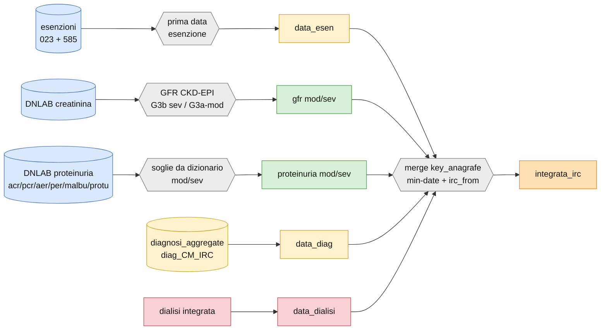

#### <ins>Diabete</ins>

**Diabete mellito.** Integrato da: esenzione (`013`), emoglobina glicata elevata, terapia
antidiabetica (macro‑classe AMA/DIABETE) e diagnosi aggregata `diag_CM_DM`. La data
integrata è la minima tra le fonti; `diabete_from` ne indica l'origine. Output:
`integrata_dm`, `data_integrata_dm`.

A valle, il diabetico è **stratificato per rischio** (macro `%diabete`): danno d'organo
`DMTOD` (IRC, cardiopatia ischemica, neuro/retinopatia diabetica, arteriopatia, GFR<60,
proteinuria); danno severo `DMSTOD` (GFR<45, o 45–59 con proteinuria, o proteinuria grave,
o ≥3 fattori combinati); durata ≥10 anni `DM10a`; classi finali *moderate / high / veryhigh*.

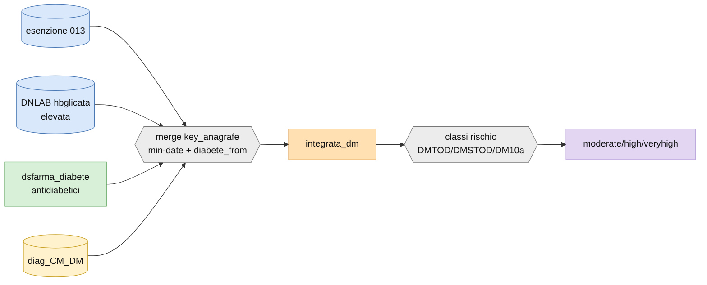

#### <ins>Scompenso</ins>

**Scompenso cardiaco cronico (SCC).** Integrato da **tre** fonti (nessun farmaco):
- **SDO** — ricoveri con `ICD9_CV_SCCPNE_ANA = 1` (scompenso secondo la definizione
  **PNE**), prima data (`data_scc_dasdo`);
- **esenzione** — codice `021`, prima data (`data_scc_daesenz`);
- **C@rdioNet** — etichetta cardionet `SCC = 1`, prima data (`data_scc_dacardio`).

`data_integrata_scc = min(cardionet, esenzione, sdo)`; `scc_from` = `sdo` / `car` / `ese`;
il soggetto è affetto se `1jan1900 ≤ data_integrata_scc < data_indice`. Output:
`integrata_scc`, `data_integrata_scc`.

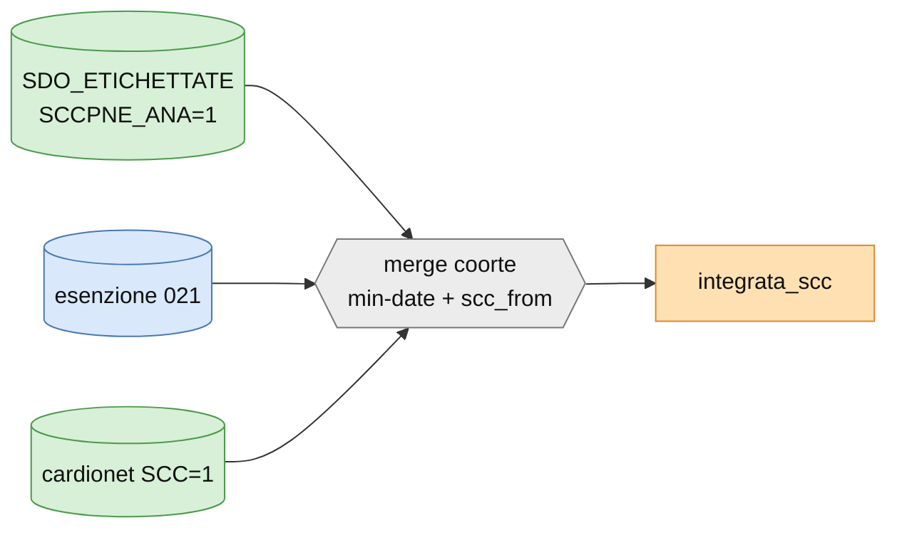

#### <ins>BPCO</ins>

**Broncopneumopatia cronica ostruttiva.** È l'esempio **esteso** dello schema della
diagnosi integrata, con tutti i dataset intermedi.

**Merge iniziale (`temp_farma01`).** I dati di `egtask.dsfarma_bpco` (con filtro
`classe ≠ 'OSSIGENO'`) e della coorte (`&coorte.`, con almeno `key_anagrafe` e
`data_indice`) vengono uniti in `temp_farma01`.

**Ramo "anno".** Da `temp_farma01` si genera `temp_anno00` (ordinato per key_anagrafe /
data_indice / data_prescrizione), trasposto in due dataset (date con prefisso `dacq`,
quantità con prefisso `acq`) e riunito in `temp_anno01`. Dopo i contatori
(`temp_counter_anno01/02`, macro `limit_anno`) si calcola `farma_anno` — la data d'inizio
acquisto se la somma raggiunge almeno **5** in un intervallo.

**Ramo "classe".** In parallelo `temp_classe00` viene trasposto e processato (contatori
`temp_counter_classe01/02`, macro `limit_classe`) per ottenere `farma_classe` — se la
somma raggiunge almeno **3**.

**Altri rami.** `dia_bpcodadiag` (da `EGTASK.DIAGNOSI_AGGREGATE`, diagnosi BPCO unite alla
coorte); esenzioni gestite in due flussi → `dia_esenti` (prima data d'esenzione) e
`dia_esclusi`; SDO (codici ICD‑9 asma da `DIZ.DIZIONARIO_BPCOINT`, merge con
`egtask.sdo_generica`, macro `%unica`) → `dia_sdo493`.

**Merge finale.** Coorte + `farma_anno` + `farma_classe` + `dia_esenti` + `dia_esclusi` +
`dia_sdo493` + `dia_bpcodadiag` → dataset integrato; `data_integrata_bpco` = minimo tra
diagnosi, farma_anno, farma_classe ed esenzione; `bpco_from` indica la fonte. Output:
`integrata_bpco`, `data_integrata_bpco`.

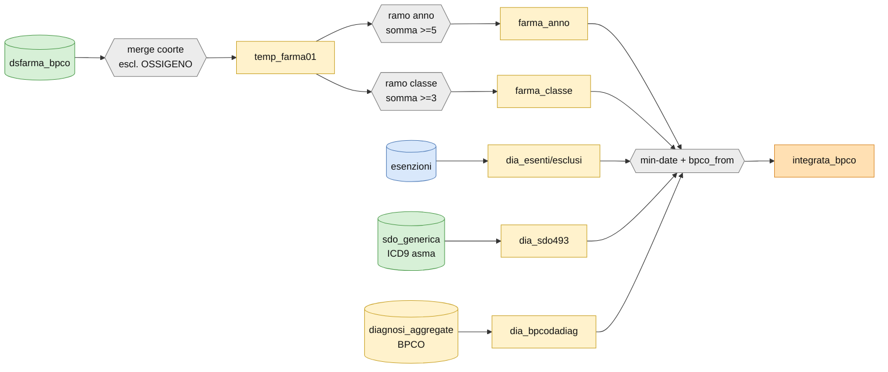

#### <ins>COVID</ins>

**Infezione da SARS‑CoV‑2.** Integrata dalle segnalazioni/tamponi COVID ed eventuali
ricoveri correlati. Output: `integrata_covid`, `data_integrata_covid` (variabili non
trattenute di default nel datamart).

> ⚠︎ **Limite.** Materiale scarso: nessuna versione L3 master; la ricetta (fonti/finestre)
> è inline nel flusso COVID.

#### <ins>Fibrillazione atriale</ins>

**FA.** Integrata da **quattro** fonti (senza esenzione né farmaci): il **referto ECG**
(FA rilevata all'elettrocardiogramma), la **C@rdioNet** (etichetta `FA = 1`, prima data),
il **pronto soccorso** (episodio PS con diagnosi di FA) e le **SDO** (`ICD9_CV_FA = 1`).

`data_integrata_fa = min(ecg, cardionet, pronto soccorso, sdo)`; `fa_from` = `ecg` / `vis`
/ `ps` / `sdo`; affetto se `0 < data_integrata_fa < data_indice`. Output: `integrata_fa`,
`data_integrata_fa`.

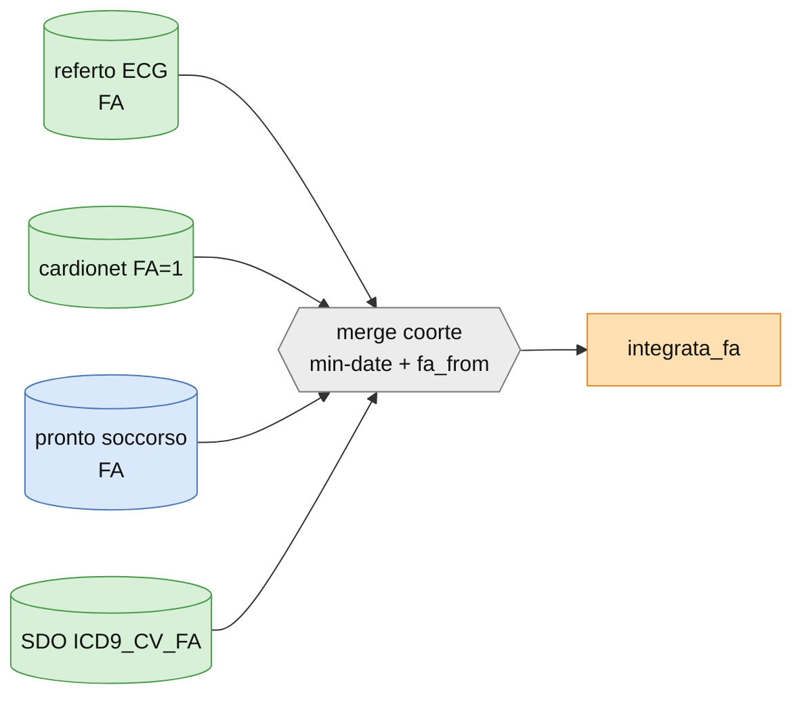

#### <ins>Ipertensione</ins>

**Ipertensione arteriosa.** La più articolata: combina **esenzione**, **diagnosi**,
**terapia** (con regole di conteggio) e **SDO**.
- **Esenzione** — codici `0031` / `031A`.
- **Diagnosi aggregata** — `DIAG_FR_HYPERTENS = 1` oppure `diag_CV_HYPERTENSIVE_HD = 1`.
- **Terapia antipertensiva** — soddisfatta quando c'è un uso **ripetuto** di una classe:
  ≥ 2 prescrizioni di diuretici (esclusi furosemide, metolazone, torasemide…),
  ACE/sartani, betabloccanti (o diltiazem/verapamil) o calcio‑antagonisti; oppure ≥ 3
  prescrizioni di antipertensivi generici. Alcune classi contano solo se combinate con un
  ricovero (scompenso o cardiopatia ischemica/aritmie). `data_farma` = prima data utile tra
  queste.
- **SDO** — ricoveri per aritmie, cardiopatia ischemica cronica, FA o scompenso.
- Sono **esclusi** i casi di ipertensione secondaria (`ICD9_ANTYHYPER`).

`data_integrata_ipertensione = min(esenzione, diagnosi, terapia)`. Output:
`integrata_ipertensione`, `data_integrata_ipertensione`.

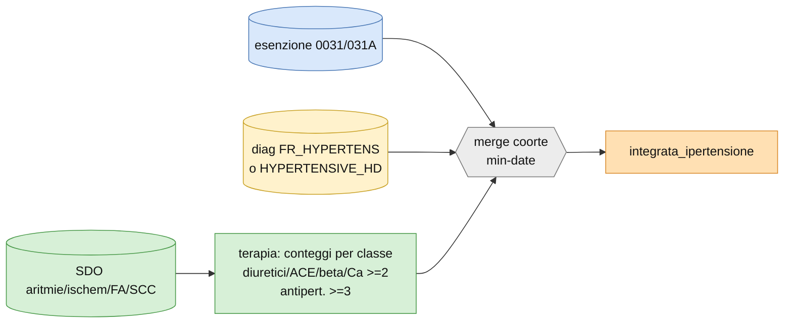

#### <ins>Dislipidemia</ins>

**Dislipidemia.** Integrata da diagnosi, LDL e terapia:
- **Diagnosi aggregata** — `diag_FR_DYSLIP = 1`;
- **LDL** — dal profilo lipidico unificato (`ESAMI_LDL_UNIFICATO`) con **LDL > 115 mg/dL**
  (si prende il valore massimo);
- **Statine/ipolipemizzanti** — prima prescrizione (`DSFARMA_IPOLIPEMIZZANTI`) in una
  finestra fino a **10 anni** prima della data di riferimento;
- **Esenzione** — codice `025` (estratta ma non usata nel calcolo della data).

`data_integrata_dislipidemia = min(statine, LDL, diagnosi)`; affetto se la data è valida e
precedente al riferimento temporale. Output: `integrata_dislipidemia`,
`data_integrata_dislipidemia`.

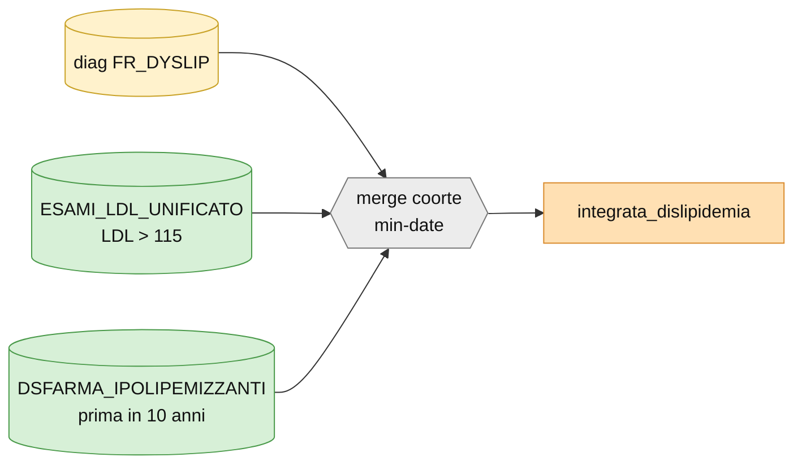

#### <ins>Anemia</ins>

**Anemia.** Integrata da laboratorio e diagnosi:
- **Emoglobina** — soglia **sesso‑specifica**: `< 12 g/dL` per le donne, `< 13 g/dL` per gli
  uomini, nella finestra `data_indice − 365 … data_indice + 30`; si tiene la prima data;
- **Diagnosi aggregata** — `diag_CM_ANEMIA = 1` (ICD‑9 280–285), stessa finestra.

`data_integrata_anemia = min(diagnosi, emoglobina)`; `anemia_from` = `diag` / `hb`; affetto
se `0 < data < data_indice`. Output: `integrata_anemia`, `data_integrata_anemia`.

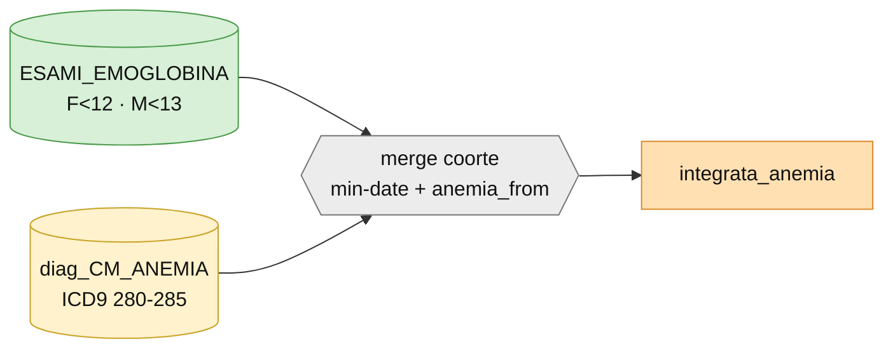

#### <ins>Rischio CVMA</ins>

**Rischio cardiovascolare molto alto (RCVMA).** Non è una diagnosi da fonti L0 ma un
**flag L4** che marca i soggetti a rischio CV molto alto. Vale `1` se è presente **almeno
una** di queste condizioni:
- **ASCVD conclamata** — cardiopatia ischemica cronica, TIA/ictus o arteriopatia periferica;
- **diabete con danno d'organo** — diabete integrato più IRC, cardiopatia ischemica,
  neuro/retinopatia diabetica, arteriopatia o GFR < 60;
- **diabete ad alto carico di rischio** — diabete più ≥ 3 fattori di rischio (ipertensione,
  dislipidemia, fumo, obesità, familiarità) oppure diabete da ≥ 10 anni;
- **IRC severa** — GFR < 30.

`data_integrata_rcvma = min(data diabete, data ICD‑9, data prelievo, oggi)`. Output:
`integrata_rcvma`, `data_integrata_rcvma`.

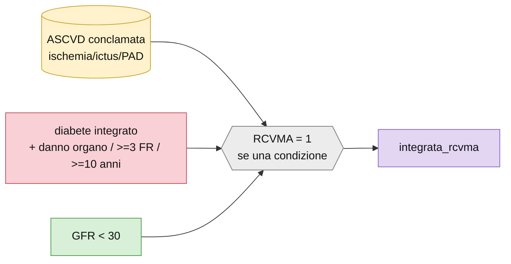

#### <ins>Ipercolesterolemia familiare</ins>

**Ipercolesterolemia familiare.** Non un semplice min‑date, ma una **classificazione a
criteri** (stile Dutch/MEDPED) che combina tre elementi:
- **LDL corretto per la terapia** — l'LDL misurato pre‑indice viene "scorporato" dall'effetto
  della terapia ipolipemizzante in corso: `LDL_teorico = LDL_misurato / (1 − potenza)`, dove
  la potenza dipende dai farmaci nella finestra `LDL − 90 giorni … LDL`;
- **Familiarità cardiovascolare** — flag `FR_FAM_CV` e ASCVD precoce dei **genitori**
  (ricostruiti via `key_anagrafe` di madre e padre: PTCA, bypass, arteriopatia, TIA/ictus da
  diagnosi aggregate e SDO);
- **ASCVD precoce del paziente** — PTCA, bypass, arteriopatia, TIA/ictus o infarto con
  **età giovane** (donne ≤ 60, uomini ≤ 55 anni).

Output: `integrata_ipercolfam`, `data_integrata_ipercolfam`.

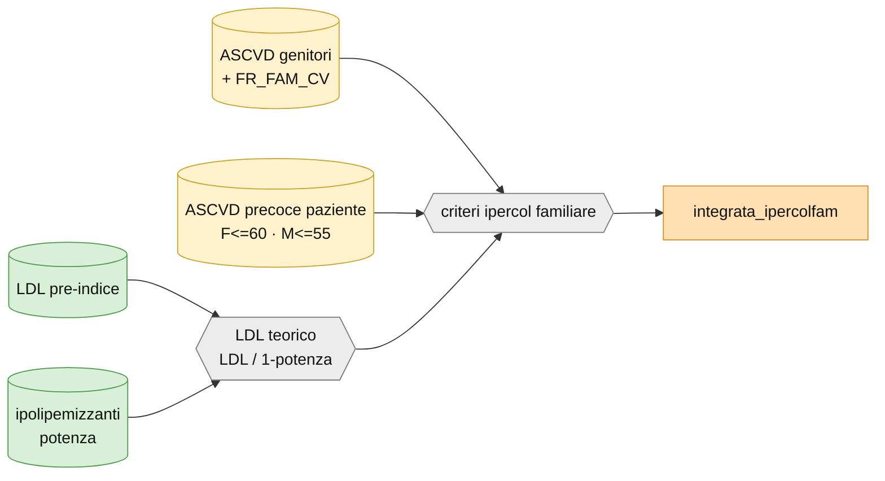

#### <ins>Microalbuminuria</ins>

**Microalbuminuria.** Integrata da laboratorio urinario e SDO:
- **Laboratorio** — i marcatori di proteinuria (MALBU, ACR, PCR, AER, PER, PROTU) sono
  valutati con soglia **dipendente dall'unità di misura**: ≥ 3 mg/24h, ≥ 2 mg/dL,
  ≥ 20 mg/L, ≥ 30 mg/g → positività (`lab_microalb`); si tiene il massimo per persona/indice;
- **SDO** — `diag_CM_ALBUMINURIA = 1`.

Output: `integrata_microalbuminuria`, `data_integrata_microalbuminuria`.

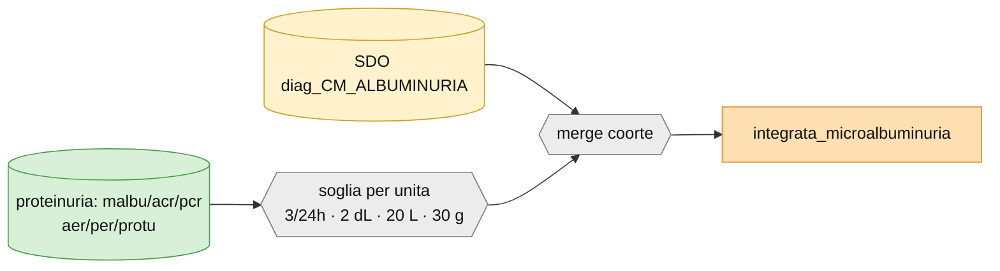

#### <ins>Obesità</ins>

**Obesità.** Integrata da antropometria e diagnosi:
- **BMI** — calcolato dai parametri funzionali C@rdioNet (peso e altezza):
  `BMI = ceil(peso / (altezza/100)²)`, si tiene chi ha **BMI ≥ 30**;
- **Diagnosi aggregata** — `diag_FR_OBESITA = 1`.

`data_integrata_obesita = min(data BMI, data diagnosi)`; affetto se la data è valida. Output:
`integrata_obesita`, `data_integrata_obesita`.

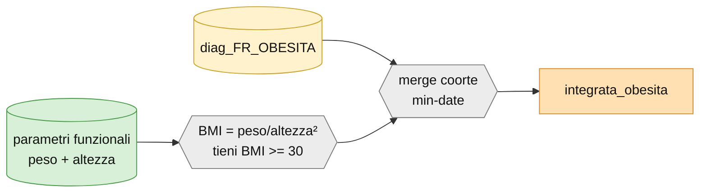

#### <ins>Dialisi</ins>

**Dialisi.** Integrata da esenzione per dialisi, prestazioni ambulatoriali di dialisi e
ricoveri; la data è la minima tra le fonti. È anche una delle **fonti dell'IRC** (fornisce
`data_dialisi`). Output: `integrata_dialisi`, `data_integrata_dialisi`.

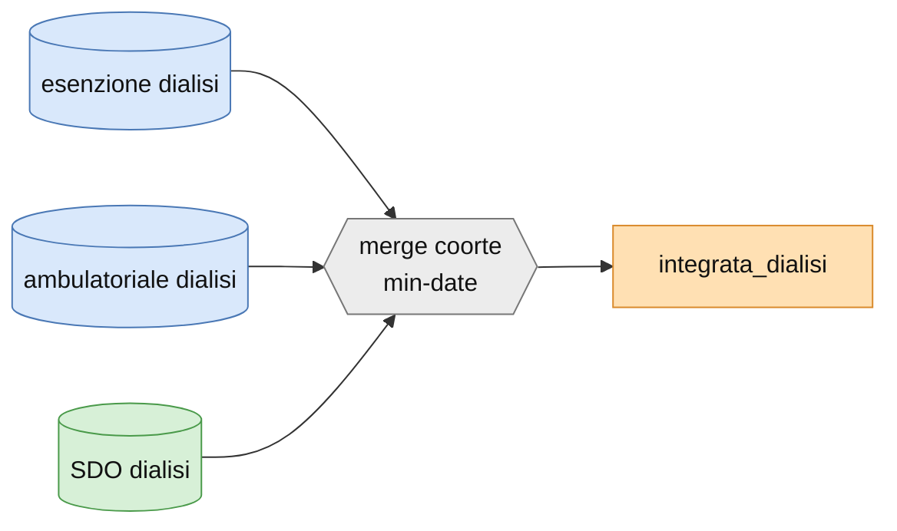

---

### Esami

Gli esami comprendono il **laboratorio** e gli **esami strumentali** cardiologici e
respiratori, tutti agganciati alla coorte.

#### <ins>Laboratorio</ins>

**Definizione.** Aggancia alla coorte gli esami costruiti dal [builder
B0](#esami-di-laboratorio--builder-b0) e ne deriva gli indicatori clinici (GFR, classi
renali, KDIGO).

**Costruzione.** Per ogni esame, la macro `buildesamiD`/`buildesamiC` fa il join
`coorte × ESAMI.esami_<esame>` tenendo i prelievi nella finestra **`data_indice − 365 …
data_indice + 90`** giorni, con risultato non mancante. Per ciascun prelievo calcola la
distanza dall'indice (`DISTGG`), la posizione `IPP` (0 = stesso giorno, 1 = precedente,
2 = successivo) e la distanza assoluta; ordina per `IPP` poi distanza e tiene il **primo
per data indice** → il valore più vicino all'indice, con priorità **stesso giorno →
precedente → successivo**. Ne risultano `LAB_<esame>` e `LAB_DATA_<esame>`.

**Assemblaggio e variabili derivate.** Tutti gli esami (più la lipoproteina(a), presa al
prelievo a distanza minima) sono uniti alla coorte; poi si calcolano: età, **GFR** con
CKD‑EPI (`%GFR_simple`) e BIS1 (`%BIS1`), la classe di funzione renale (`%classe_gfr`), le
classi di proteinuria per ciascun marcatore (`%classe_protu/malbu/acraer/pcrper` +
`%classe_proteinuria`), la griglia **KDIGO 2014** (`%kdigo14`) e il colesterolo non‑HDL
(`LAB_CnotHDL = LAB_COL − LAB_HDL`).

**Output.** `clinico.&nome._laboratorio` — 14 variabili trattenute su 38: `GFR_CKDEPI`,
`GFR_BIS1`, `LAB_ACR`, `LAB_AER`, `LAB_ALBUMINA`, `LAB_BNP`, `LAB_COL`, `LAB_CRCL`,
`LAB_CREATININA`, `LAB_EMOGLOBINA`, `LAB_GLICEMIA`, `LAB_HBGLICATA`, `LAB_HDL`, `LAB_LDL`.
Gli altri (PCR, PER, MALBU, PROTU, elettroliti, funzione epatica, ferro, TSH, troponina, …)
sono calcolati ma non trattenuti di default.

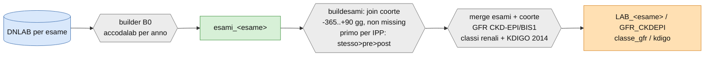

#### <ins>ECO ed ECG</ins>

**Definizione.** Esami strumentali cardiologici da C@rdioNet: **ecocardiografia** (ECO, da
`DWTSISSR.VFP_CARDIO_ECO`) ed **elettrocardiografia** (ECG, da
`DWTSISSR.VFP_CARDIO_ECG_MORTARA`). Costruiti con lo stesso schema.

**Costruzione.** L'esame è estratto in tre finestre temporali rispetto all'indice —
**PRE** (`data_indice − 365 … data_indice`), INTRA e POST — e unito; si tiene il **primo
per data indice** (priorità PRE), calcolando `data_eco`/`data_ecg` e la distanza
`dist_eco`/`dist_ecg`. Infine un passo **guidato da dizionario** (`data _null_` sulla lista
`veco`/`vecg` delle variabili da tenere, con eventuale rinomina) costruisce dinamicamente
una `PROC SQL` che riaggancia la sorgente C@rdioNet (`key_eco_cardio` / `key_ecg_mortara`)
per portare **tutte le misure selezionate** nell'output.

**Output.** `clinico.&nome._eco` (catalogo 113 variabili) e `clinico.&nome._ecg` (17). La
selezione delle misure è specifica dello studio (lista `veco`/`vecg`).

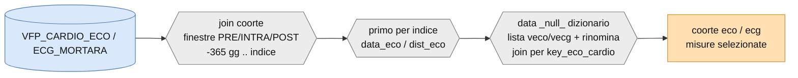

#### <ins>Spirometrie</ins>

**Definizione.** Esami di funzionalità respiratoria dal flusso ambulatoriale.

**Costruzione.** Si selezionano dal dizionario prestazioni (`VDIZIONARIO_PRESTAZIONI`) i
codici la cui descrizione **contiene "SPIRO"**; la macro `accoda_anni_spyro` accoda, anno
per anno, le prestazioni ambulatoriali (`VFP_AMBULATORIALE_PRESTAZ_<anno>`) con quei codici
e `key_anagrafe ≠ 0`, tenendo la `data_prestazione`. Il risultato è unito alla coorte e,
ordinando per data decrescente, si tiene la spirometria **più recente per data indice**.

**Output.** `clinico.&nome._spirometrie`.

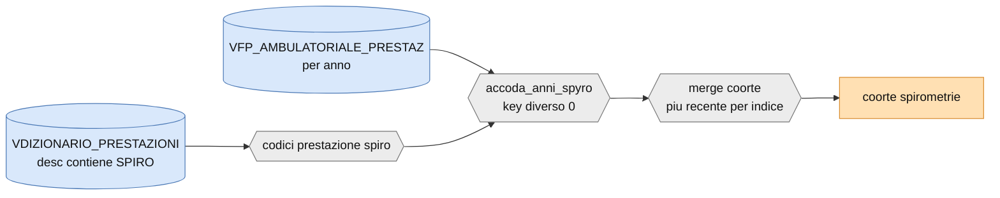

#### <ins>Fenotipo</ins>

**Definizione.** Classificazione del **fenotipo di scompenso** in base alla frazione di
eiezione ventricolare sinistra (LVEF), da ecocardiografia C@rdioNet (`VFP_CARDIO_ECO`) e
dall'eco morfologica (`VFP_CARDIO_ECO_MORFOLOGICA`, con dizionario `DIZIONARIO_ECOMORF`).

**Costruzione.** Il fenotipo è assegnato così: **REF** (*reduced*, ridotta) se LVEF < 50;
**PEF** (*preserved*, conservata) se LVEF ≥ 50; se la LVEF manca si usa il fallback
morfologico/descrittivo; altrimenti **NN** (non classificabile). Si tiene il fenotipo
peggiore nel tempo e si calcolano la LVEF pre‑indice **minima, massima e ultima** con le
rispettive date (`min/max/last_lvef_prealltime`) e l'anno dell'ultima LVEF.

**Output.** `clinico.&nome._fenotipo` — `fenotipo`, `lvef_incidenza`, LVEF pre‑indice
min/max/last con date, `anno_lvef`.

```mermaid
flowchart LR
  eco[(VFP_CARDIO_ECO<br/>LVEF)]:::l0 --> CL{{fenotipo da LVEF<br/>REF &lt;50 · PEF &gt;=50 · NN}}:::tf
  morf[(VFP_CARDIO_ECO_MORFOLOGICA<br/>dizionario ecomorf)]:::l0 --> CL
  eco --> LV{{LVEF pre-indice<br/>min / max / last}}:::tf
  CL --> OUT[coorte fenotipo<br/>fenotipo + LVEF min/max/last]:::out
  LV --> OUT
  classDef l0 fill:#d9e8fb,stroke:#4a78b5,color:#111;
  classDef tf fill:#ececec,stroke:#777,color:#111;
  classDef out fill:#ffe0b3,stroke:#d98a2b,color:#111;
```

#### <ins>Parametri funzionali</ins>

**Definizione.** Parametri clinico‑funzionali da C@rdioNet (`VFP_CARDIO_PARAMFUNZ`):
pressione, frequenza, antropometria, classe NYHA, saturazione, INR, ecc.

**Costruzione.** La selezione è guidata dalla tabella `SELEZIONE_PARAMETRI_FUNZIONALI`
(righe con `TENERE = 1`, con `VARIABILE`, `ORDINE`, `NUOVO_NOME`, `TIPO`). I parametri —
separati in **alfanumerici** e **numerici** — vengono **trasposti** (`PROC TRANSPOSE`,
`ID = CAR_PFUN_DESCRIZIONE`): ogni descrizione di parametro diventa una **colonna** per
persona/data indice, con l'eventuale rinomina.

**Output.** `clinico.&nome._parametri_funzionali` — catalogo 574 variabili, ~10 trattenute:
`PAS`, `PAD`, `FC`, `SO2`, peso, altezza, circonferenza addominale, classe `NYHA`, `TTR(INR)`.

```mermaid
flowchart LR
  pf[(VFP_CARDIO_PARAMFUNZ)]:::l0 --> SEL{{selezione TENERE=1<br/>variabile/ordine/nuovo_nome}}:::tf
  SEL --> TR{{transpose per indice<br/>alfanumerici + numerici<br/>parametro -&gt; colonna}}:::tf --> OUT[coorte parametri_funzionali<br/>PAS/PAD/FC/NYHA/...]:::out
  classDef l0 fill:#d9e8fb,stroke:#4a78b5,color:#111;
  classDef tf fill:#ececec,stroke:#777,color:#111;
  classDef out fill:#ffe0b3,stroke:#d98a2b,color:#111;
```

---

### Eventi

Gli eventi sono **endpoint compositi**: misurano il tempo al primo di un insieme di eventi
clinici (o al decesso) dopo la data indice. MALE e MACE sono costruiti con lo **stesso
schema**, che conviene descrivere una volta.

**Lo schema comune.**
1. **Estrazione dai ricoveri.** Si parte da `EGTASK.SDO_ETICHETTATE` (le SDO già etichettate
   ICD‑9 dal [builder A01](#sdo--builder-a01)), in join con la coorte, tenendo **solo i
   ricoveri successivi alla data indice** (`data_ingresso > data_indice`). Ogni tipo di
   evento è una colonna‑etichetta 0/1 della SDO.
2. **Data dell'evento = data di ricovero.** Per ogni evento presente, la data è la
   `data_ingresso`; si collassa a una riga per persona/data indice tenendo la **prima** data
   di ciascun tipo di evento.
3. **Decesso e censura.** `data_decesso = 31dec9999` significa "nessun decesso" (censura alla
   data amministrativa, `MORTO = 0`); una data valida dà `MORTO = 1`. `data_censura` = data
   amministrativa se vivo, altrimenti la data di decesso.
4. **Composito.** `data_<endpoint> = min(data_decesso, date dei singoli eventi)`; il flag
   `<endpoint> = 1` se si è verificato **almeno un evento o il decesso**; la distanza
   `dist = min(data_evento, data_censura) − data_indice` è il tempo di follow‑up in giorni.

```mermaid
flowchart LR
  sdo[(SDO_ETICHETTATE)]:::l1 --> J{{join coorte<br/>ricovero DOPO data_indice}}:::tf --> ev[eventi elementari<br/>data = data_ingresso]:::l2
  dec[(anagrafe decesso)]:::l0 --> MIN
  ev --> FIRST{{prima data<br/>per tipo evento}}:::tf --> MIN{{data = min eventi + decesso<br/>flag 0/1 · distanza da indice}}:::tf
  MIN --> OUT[male / mace3 / mace5<br/>data + flag + dist]:::out
  classDef l0 fill:#d9e8fb,stroke:#4a78b5,color:#111;
  classDef l1 fill:#d7f0d7,stroke:#4a9a4a,color:#111;
  classDef l2 fill:#fff2cc,stroke:#c9a227,color:#111;
  classDef tf fill:#ececec,stroke:#777,color:#111;
  classDef out fill:#ffe0b3,stroke:#d98a2b,color:#111;
```

#### <ins>MALE</ins>

**Major Adverse Limb Event** — eventi maggiori agli arti inferiori più il decesso.
Componenti: amputazione arti inferiori (`EVENTO_AMPUTAZ`), rivascolarizzazione arti
inferiori (`EVENTO_RIVASC`), evento ischemico/trombotico (`EVENTO_ISCHTROM`).

`data_male = min(decesso, amputazione, ischemico, rivascolarizzazione)`;
`male = 1` se almeno una componente o il decesso. Output: `male`, `data_male`, `distmale`.

#### <ins>MACE 3p e 5p</ins>

**Major Adverse Cardiovascular Event**, in due definizioni.

- **3‑point (classico):** infarto miocardico acuto (`EVENTO_IMA`), ictus (`EVENTO_STROKE`)
  e decesso.
  `data_mace3 = min(decesso, IMA, stroke)`; `mace3 = 1` se IMA o stroke o decesso.
- **5‑point:** aggiunge scompenso ospedalizzato (definizione PNE, `EVENTO_SCC`), bypass
  aortocoronarico (`EVENTO_BAC`) e angioplastica coronarica (`EVENTO_PTCA`).
  `data_mace5 = min(decesso, IMA, stroke, scompenso, bypass, angioplastica)`; `mace5 = 1`
  se una qualsiasi di queste o il decesso.

Output: `mace3`, `mace5`, `data_mace3`, `data_mace5`, `dist3pi`, `dist5pi`.

| Endpoint | Componenti (oltre al decesso) |
|---|---|
| **MALE** | amputazione, rivascolarizzazione AAII, evento ischemico/trombotico |
| **MACE 3p** | infarto (IMA), ictus (stroke) |
| **MACE 5p** | infarto, ictus, scompenso (PNE), bypass (BAC), angioplastica (PTCA) |

#### <ins>Eventi di ricovero</ins>

Eventi di ospedalizzazione classificati per tipo (CV/non‑CV, per apparato), dalle SDO. Tra
le variabili trattenute: ricoveri CV e non‑CV, IRC, malattia renale, dialisi, interventi,
scompenso, valvole, ASCVD multisito.

#### <ins>Emorragie maggiori</ins>

Eventi emorragici rilevanti, distinti per tipo (macro `accoda_emod`). Output: `emomag_a`,
`emomag_f`, `data_emomag_a`, `data_emomag_f`.

---

### Prestazioni

Le prestazioni accodano alla coorte, con conteggi per anno, le erogazioni dal **CUP**, da
**C@rdioNet** e dal **Pronto Soccorso**. Le prestazioni CUP sono filtrate per tipologia
(macro `accodacupprest` + `accodacupstrut`), dando origine ai rami sotto.

| Prestazione | Fonte | Output coorte |
|---|---|---|
| CUP altro | `vfp_cup_prestsan_`, `vdizionario_cup_prestsan` | `prestazioni_altro` |
| CUP ECG | CUP (filtro ECG) | `prestazioni_ecg` |
| CUP ECO | CUP (filtro ECO) | `prestazioni_eco` |
| CUP ecovasco | CUP (ecografia vascolare) | `prestazioni_ecov` |
| CUP ecocardio | CUP (ecocardiografia) | `prestazioni_ecoc` |
| CUP tutte | CUP (nessun filtro) | `prestazioni_tutte` |
| CUP spiro | ambulatoriale/CUP (spirometria) | `prestazioni_spiro` |
| CUP visite | CUP (visite specialistiche) | `prestazioni_visite` |
| prest. C@rdioNet | `vfp_cardio_visita` | `prestazioni_cardionet` |
| pronto soccorso | `vfp_ps_episodi_` | `pronto_soccorso` |

```mermaid
flowchart LR
  cup[(CUP prestsan)]:::l0 --> AP{{accodacupprest per anno<br/>filtro tipo prestazione}}:::tf
  strut[(CUP strutture)]:::l0 --> AS{{accodacupstrut}}:::tf
  AP --> merge{{merge coorte<br/>conteggi per anno}}:::tf
  AS --> merge --> OUT[prestazioni_&lt;tipo&gt;]:::out
  ps[(PS episodi)]:::l0 -.-> OUT
  card[(cardionet visite)]:::l0 -.-> OUT
  classDef l0 fill:#d9e8fb,stroke:#4a78b5,color:#111;
  classDef tf fill:#ececec,stroke:#777,color:#111;
  classDef out fill:#ffe0b3,stroke:#d98a2b,color:#111;
```

> ⚠︎ **Limite.** Nessuna prestazione ha un foglio nel datamart‑builder: la lista variabili
> di output va letta dalle colonne del dataset prodotto.

---

### Score

Gli score sintetizzano il profilo di rischio o comorbidità in un unico indicatore. Cinque
unità hanno `type=score`: **SCORE2**, **SCOREC**, **Charlson**, **ESC** e **classi di
rischio CV** (che aggrega diagnosi integrate e score). SCORE2 e SCOREC dipendono dal diabete
integrato.

#### <ins>SCORE2 e SCORE2-OP</ins>

Rischio cardiovascolare a 10 anni da età, sesso, pressione sistolica, colesterolo totale,
HDL, fumo e diabete. Distingue `young` (età ≤ 69, **SCORE2**) da `old` (> 69,
**SCORE2‑OP** *Older Persons*), con centrature e coefficienti diversi. Il rischio è calcolato
**direttamente** dalla baseline‑survival: `score2 = (1 − s0^exp(predittore)) × 100`, senza
un passo di ricalibrazione esplicito. Output: `SCORE2`, `risk_class_score2`,
`flag_missing_score2`.

#### <ins>SCOREC</ins>

Calcola il rischio a 10 anni con **la stessa forma di SCORE2** (stessi predittori — età,
sesso, pressione sistolica, colesterolo totale, HDL, fumo, diabete — stessa centratura,
coefficienti specifici per sesso e forma `1 − s0^exp(predittore)`), **ma applica in più un
passo di ricalibrazione** che l'EGP SCORE2 non ha:

```
uncalibrated = 1 − s0^exp(predittore)
SCOREC = 1 − exp( − exp( scale1 + scale2 · log( −log(1 − uncalibrated) ) ) )
```

Quella trasformazione `scale1/scale2` sul complementary log‑log è il passo di
**ricalibrazione regionale** del metodo SCORE2 (da cui, verosimilmente, la `C` di
*calibrato*). Il risultato è in percentuale; se manca uno tra età, pressione, colesterolo o
HDL, `SCOREC` non è calcolato. Output: `SCOREC`, `risk_class_scorec`, `flag_missing_scorec`.
Nel grafo: EGP `SCOREC`, flusso `SCORECAL`, output L4 `CLINICO.COORTE_SCOREC`.

> ⚠︎ **Nota.** Il sorgente non documenta la provenienza dei coefficienti `b*` né dei valori
> `scale1/scale2`, quindi *quale* ricalibrazione (per quale regione di rischio) è
> un'inferenza dalla forma del codice, non un'etichetta scritta nel programma.

```mermaid
flowchart LR
  par[eta/sesso/pas]:::l1 --> SC{{rischio SCORE2<br/>1 - s0^exp predittore}}:::tf
  lab[col/hdl]:::l1 --> SC
  dm[diabete integrato]:::l3 --> SC
  SC --> RC{{ricalibrazione<br/>scale1 + scale2 · cloglog}}:::tf
  RC --> OUT[SCOREC<br/>risk_class_scorec<br/>flag_missing_scorec]:::l4
  classDef l1 fill:#d7f0d7,stroke:#4a9a4a,color:#111;
  classDef l3 fill:#f8d0d5,stroke:#c04a57,color:#111;
  classDef l4 fill:#e2d6f3,stroke:#8a63c0,color:#111;
  classDef tf fill:#ececec,stroke:#777,color:#111;
```

#### <ins>Charlson</ins>

**Charlson Comorbidity Index** — indice di comorbidità costruito dai ricoveri e dalle
diagnosi aggregate, come somma pesata delle condizioni croniche. Output: `charlson_score`.

#### <ins>ESC</ins>

**ESC score** — punteggio di rischio secondo le linee guida della Società Europea di
Cardiologia. Output: `escscore`.

#### <ins>Classi di rischio cardiovascolare</ins>

Classificazione finale del rischio CV (CLRCV, L4), che combina diagnosi integrate,
laboratorio e parametri. Prodotta nel flusso CLASSI_RISCHIO. Output: `classi_rischio`
(oltre alle `integrata_*` per diagnosi).

```mermaid
flowchart LR
  diag[diagnosi integrate L3]:::l3 --> CR{{classi rischio CV}}:::tf
  lab[laboratorio]:::l1 --> CR
  par[parametri funzionali]:::l1 --> CR
  CR --> OUT[classi_rischio / score]:::l4
  classDef l1 fill:#d7f0d7,stroke:#4a9a4a,color:#111;
  classDef l3 fill:#f8d0d5,stroke:#c04a57,color:#111;
  classDef l4 fill:#e2d6f3,stroke:#8a63c0,color:#111;
  classDef tf fill:#ececec,stroke:#777,color:#111;
```

---

### Terapia

La terapia descrive i farmaci del soggetto da due fonti: la **farmaceutica territoriale** e
la **terapia registrata in C@rdioNet**.

#### <ins>Terapia farmaceutica</ins>

La terapia farmaceutica territoriale **non è una singola variabile** ma un blocco
**composito**: dalle macro‑classi `dsfarma_*` del
[builder FARMATERR](#farmaceutica-territoriale--builder-farmaterr) si costruiscono più
componenti, con finestre temporali diverse per protocollo. Il mattone comune (`build_farma`)
aggancia la coorte a `DSFARMA_<classe>` in una finestra ampia (CLINICO:
`data_indice − 365 … data_indice + 730`); da lì si derivano i pezzi.

**Componenti (protocollo CLINICO).**

1. **Potenza ipolipemizzante.** Gli ipolipemizzanti — territoriali **più** quelli
   aziendali (`ipolipo_azienda`) — sono scomposti in cinque componenti: **statine** (STA),
   **ezetimibe** (EZE), **acido bempedoico** (BEM), **inclisiran** (INC) e **PCSK9‑inibitori**
   (PCS, gli "‑cumab"). Per le statine la potenza dipende dalla **quantità** a scaglioni
   (≤ 5 / 5–15 / 15–30 / 30–60 / > 60). La potenza complessiva è calcolata **all'indice**
   (finestra `−90 … +180`) e al **follow‑up** (`potenza_fup`): il valore più vicino all'LDL
   preso a **1 anno** dalla data indice; se non c'è, la potenza più vicina a 12 mesi.
2. **Somme per classe a 6 e 12 mesi** (`somma6fup`, `somma12fup`): numero di prescrizioni per
   persona/indice/classe nelle due finestre.
3. **Costo a 12 mesi** (`costo12fup`).
4. **Flag di classe** — uso della classe nel **follow‑up a 6 mesi** (`farmafup6mesi`) e in
   **anamnesi a 3 mesi** (`farma3anam`), come 0/1.

Il dataset finale (`clinico.&nome._farmaceutica`) **unisce** coorte + `farma3anam` +
`farmafup6mesi` + `potenza_indice` + `potenza_fup` + `somma6fup` + `somma12fup` +
`costo12fup`, e trattiene le classi trovate (`lista_found`), le `somma*`, i `costo*` e la
`potenza_d365`. Nel datamart, tra le variabili trattenute: `PCSK9I`, `INCLISIRAN`.

**Finestre e output per protocollo.**

- **CLINICO** — potenza ipolipemizzanti `−90 … +180`; somme e flag a 6/12 mesi e anamnesi 3
  mesi (come sopra).
- **PDTA** — `data_uscita_indice … +730`: somma della **copertura annua per classe**, flag
  0/1 di classe, `last_AA` / `last_ASA` / `last_NAOTAO` (ultima prescrizione di
  antiaggreganti/ASA/anticoagulanti), somma ATC per persona.
- **EPI4M** — `data_indice … +365`: potenza ipolipemizzanti (indice `−365 … 0`, follow‑up
  `+270 … +360`), somma grezza degli ATC per persona.

```mermaid
flowchart LR
  dsf[(dsfarma_&lt;classe&gt;)]:::l1 --> BF{{build_farma: join coorte<br/>finestra ampia per classe}}:::tf
  azi[(ipolipo aziendale)]:::l1 --> POT
  BF --> POT{{potenza ipolipemizzante<br/>STA/EZE/BEM/INC/PCS<br/>statina per quantita}}:::tf
  BF --> SUM{{somme per classe<br/>6 e 12 mesi}}:::tf
  BF --> COST{{costo 12 mesi}}:::tf
  BF --> FLAG{{flag classe<br/>fup 6 mesi · anamnesi 3 mesi}}:::tf
  POT --> P1[potenza indice + fup]:::l2
  SUM --> P2[somma6/12 per classe]:::l2
  COST --> P3[costo 12 mesi]:::l2
  FLAG --> P4[flag classe]:::l2
  P1 --> M{{merge per key_anagrafe, data_indice}}:::tf
  P2 --> M
  P3 --> M
  P4 --> M
  M --> OUT[farmaceutica<br/>classi + somme + costi + potenza]:::out
  classDef l1 fill:#d7f0d7,stroke:#4a9a4a,color:#111;
  classDef l2 fill:#fff2cc,stroke:#c9a227,color:#111;
  classDef tf fill:#ececec,stroke:#777,color:#111;
  classDef out fill:#ffe0b3,stroke:#d98a2b,color:#111;
```

**Calcolo della potenza ipolipemizzante.** La "potenza" stima la **riduzione attesa
dell'LDL** (frazione tra 0 e 1) prodotta dalla terapia in corso. Le prescrizioni sono
prima classificate in cinque componenti, distinti in **orali** e **iniettivi**:

- **orali:** **statine** (STA), **ezetimibe** (EZE), **acido bempedoico** (BEM);
- **iniettivi:** **inclisiran** (INC) e **PCSK9‑inibitori** (PCS, gli "‑cumab").

La potenza di una **statina** dipende dal tipo e dalla **quantità** (`QNT_STATINA`) a cinque
scaglioni; i valori sono la % di riduzione dell'LDL:

| Statina | ≤ 5 | 5–15 | 15–30 | 30–60 | > 60 |
|---|---|---|---|---|---|
| Fluvastatina | 15 | 19 | 23 | 27 | 32 |
| Pravastatina | 18 | 22 | 26 | 30 | 34 |
| Lovastatina | 19 | 23 | 28 | 33 | 37 |
| Simvastatina | 23 | 28 | 34 | 38 | 42 |
| Atorvastatina | 29 | 34 | 39 | 45 | 50 |
| Rosuvastatina | 38 | 44 | 50 | 55 | 60 |

Gli altri farmaci hanno una potenza **fissa**: ezetimibe **20%**, acido bempedoico
**17,5%**, inclisiran **50%**, PCSK9‑inibitori **50%**.

**Formula (moltiplicativa sul residuo).** Ogni farmaco lascia un LDL residuo pari a
`(1 − p)`; la terapia combinata moltiplica i residui e la potenza complessiva è il
complemento:

```
potenza = 1 − ∏ (1 − p_i)      per ogni farmaco i presente
```

Esempio: statina (pSTA) + ezetimibe (pEZE) → `potenza = 1 − (1 − pSTA)·(1 − pEZE)`. La
formula è applicata esplicitamente per mono‑, doppia, tripla e quadrupla terapia.

**Vincoli implementati.**
- **Statina senza quantità → scartata:** la potenza statinica richiede `QNT_STATINA`; le
  righe con statina ma quantità mancante sono rimosse.
- **Iniettivi mutuamente esclusivi:** inclisiran e PCSK9‑inibitore **non possono coesistere**;
  se compaiono entrambi si tiene solo il **più recente** per data di prescrizione (l'altro è
  azzerato).
- **Bempedoico senza statina:** in assenza di statina la potenza del bempedoico è maggiorata
  (`1 − pBEM − 0.07`); in combinazione con una statina si usa il valore base (17,5%).
- Per ogni componente si prende l'**ultima** prescrizione entro la finestra (per data indice).

**Variabili derivate.** `terapia` = concatenazione dei farmaci presenti (es. `STA+EZE`);
`llt` = 1 se in terapia ipolipemizzante (potenza ≥ 0); `llthi` = 1 se terapia ad **alta
intensità** (potenza ≥ 0,5, cioè ≥ 50% di riduzione LDL attesa). Il calcolo è ripetuto
**all'indice** e al **follow‑up**.

```mermaid
flowchart LR
  presc[(prescrizioni ipolipemizzanti<br/>territoriali + aziendali)]:::l1 --> SPLIT{{classifica in 5 componenti}}:::tf
  SPLIT --> OR[orali: STA per tipo+quantita<br/>EZE 20% · BEM 17,5%]:::l2
  SPLIT --> IN{{iniettivi: INC 50% · PCS 50%<br/>mutex: tieni il piu recente}}:::tf --> INJ[INC oppure PCS]:::l2
  OR --> F{{potenza = 1 - prodotto dei residui 1-p}}:::tf
  INJ --> F
  F --> OUT[potenza + llt + llthi<br/>indice e follow-up]:::out
  classDef l1 fill:#d7f0d7,stroke:#4a9a4a,color:#111;
  classDef l2 fill:#fff2cc,stroke:#c9a227,color:#111;
  classDef tf fill:#ececec,stroke:#777,color:#111;
  classDef out fill:#ffe0b3,stroke:#d98a2b,color:#111;
```

#### <ins>Terapia C@rdioNet</ins>

La terapia farmacologica registrata nella cartella cardiologica, aggregata in classi
(ACE‑inibitori/sartani, betabloccanti, antiaggreganti, anticoagulanti, antidiabetici,
calcio‑antagonisti, diuretici, ipolipemizzanti). Per ogni classe: presenza, codice ATC,
numero di confezioni, quantità e sostanza (`<classe>`, `_ATCCOD`, `_CONF`, `_QTA`, `_SOST`).
Fonti: `vfp_cardio_terapia`, `vdizionario_farmaci_atc`, `vdizionario_farmaci_sost`. Output:
`terapiacardionet` (40 variabili trattenute su 190).

---

### Le due viste del datamart

Il datamart ha due rappresentazioni complementari, entrambe autorevoli:
- **`DATAMART-BUILDER.xlsx`** — la **specifica di selezione**, un foglio per flusso, colonna
  `TENERE`: dichiara *quali* variabili l'assembler deve trattenere.
- **`DATAMART_DAICHI-*.xlsx`** — il **datamart finale "flat"** di uno studio concreto: un
  unico foglio con le colonne effettivamente consegnate. È il **modello** di come appare
  l'output. Contiene già le variabili SCOREC (`SCOREC`, `risk_class_scorec`,
  `flag_missing_scorec`) accanto a SCORE2, a conferma che l'EGP `SCOREC` è in produzione.

---

## Note di copertura

Ricostruzione **statica** dalla pipeline di lineage (nessun accesso al server SAS). Robusta
dove esiste una macro o un foglio datamart autorevole (IRC, laboratorio, eventi, terapia
C@rdioNet, diagnosi aggregate); **best‑effort con nota ⚠︎** dove la ricetta è inline o priva
di specifica datamart (prestazioni CUP, SCORE2/SCOREC, esami strumentali, COVID, RCVMA). Le
liste variabili combaciano con i fogli `DATAMART-BUILDER.xlsx`; i filtri/soglie con i corpi
delle macro.

[^1]: Questi flussi sono accessibili solo da profilo SAS Aziendale.

[^2]: PNLAB è il laboratorio di Pordenone, importato nel DNLAB dal 2017. Prima del 2017 il DNLAB non ha Pordenone.

[^3]: AMBULATORIALE LV3 fa riferimento solo alla integrata DIALISI.
