# OCVTS — Flussi di costruzione (BUILDERS + DATAMART)

> Documento di dominio dei flussi di costruzione delle variabili OCVTS, con vista
> **top‑down**: prima il quadro generale, poi i builder (dal grezzo RER alle
> aggregazioni), infine il datamart (le variabili che finiscono nella coorte).
> Ogni capitolo apre con un **diagramma di flusso semplificato** che ricalca il
> grafo di lineage, ma con nomi leggibili e i filtri sintetizzati.
>
> Companion del manuale di dominio [`OCVTS.md`](OCVTS.md) (che descrive il RER, le
> fonti e i livelli dati L0–L4). Qui si spiega **come** ogni tabella è costruita.
> Il contenuto è ricostruito **staticamente** dalla pipeline di lineage (nessun
> accesso al server SAS); dove la ricetta non è catturabile staticamente è indicato
> con una nota **⚠︎ Limite**.

---

# Parte 0 — Visione d'insieme

## Il flusso a livelli

Il sistema OCVTS raffina i dati grezzi del RER in livelli progressivi. Ogni livello
consuma il precedente:

- **L0 — grezzo RER.** Le viste regionali `DWTSISSR.v*` (anagrafe, SDO, DNLAB,
  farmaceutica, CUP, PS, C@rdioNet, esenzioni, dizionari). Sono i **semi**: lette e
  mai prodotte.
- **L1 — prima aggregazione.** Codici raggruppati in categorie di dominio: esami di
  laboratorio (DNLAB), classi farmacologiche (ATC), ricoveri etichettati ICD‑9
  (SDO), diagnosi C@rdioNet classificate.
- **L2 — aggregazione intermedia.** Diagnosi aggregate (SDO + C@rdioNet), laboratorio
  unificato, eventi complessi (MACE/MALE).
- **L3 — diagnosi integrate.** Una patologia definita incrociando più fonti; la data
  è la **minima tra le fonti**. Coorte‑specifiche.
- **L4 — classificazione avanzata.** Classi di rischio cardiovascolare e score.

Due mondi di codice costruiscono questi livelli:

- i **BUILDERS** (folder BUILDER) portano L0 → L1 → L2 in tabelle di servizio
  riusabili da tutti gli studi (Parte 1);
- il **DATAMART / PRODUZIONE** (folder PRODUZIONE) monta, per la **coorte** di un
  singolo studio, le variabili finali L1–L4 selezionate dal referente clinico
  (Parte 2).

Tre **protocolli** di studio riusano gli stessi flussi con finestre temporali diverse:
**CLINICO** (coorte ad hoc, unità = persona/evento/esame), **PDTA** (SCC/BPCO/DIABETE,
persone ripetute su tutti gli anni), **EPI4M** (via di mezzo sulle 3 patologie).

## Cosa costruisce una "diagnosi integrata" (la regola generale)

Prima di scendere nelle singole patologie conviene fissare il **pattern comune**, che
ogni sezione del capitolo DIAGNOSI poi istanzia.

Una **diagnosi integrata** stabilisce **se** e **da quando** un soggetto è affetto da
una patologia, incrociando fonti eterogenee che parlano della stessa condizione:

- **esenzioni** (il soggetto ha un'esenzione per quella patologia);
- **esami di laboratorio** (un marcatore fuori range: es. GFR basso per l'IRC,
  emoglobina glicata alta per il diabete);
- **prescrizioni farmaceutiche** (terapia cronica coerente con la patologia);
- **diagnosi aggregate** da ricovero (SDO/ICD‑9) e da C@rdioNet.

Ogni fonte, quando presente, porta una **data di prima evidenza**. Il flusso fa il
`merge` delle fonti per `key_anagrafe` e calcola:

```
data_integrata_<patologia> = min( data_esenzione, data_laboratorio,
                                   data_farmaci,  data_diagnosi_aggregata, ... )
```

più una variabile **`<patologia>_from`** che registra **da quale fonte** proviene
quella data minima. Il soggetto è considerato affetto se `data_integrata_<x> > 0`.

Questo è il cuore di ogni scheda DIAGNOSI. La sezione **BPCO** (in [`OCVTS.md`](OCVTS.md))
è l'esempio esteso di questo pattern con tutti i dataset intermedi; qui le altre
patologie seguono la stessa forma in modo uniforme.

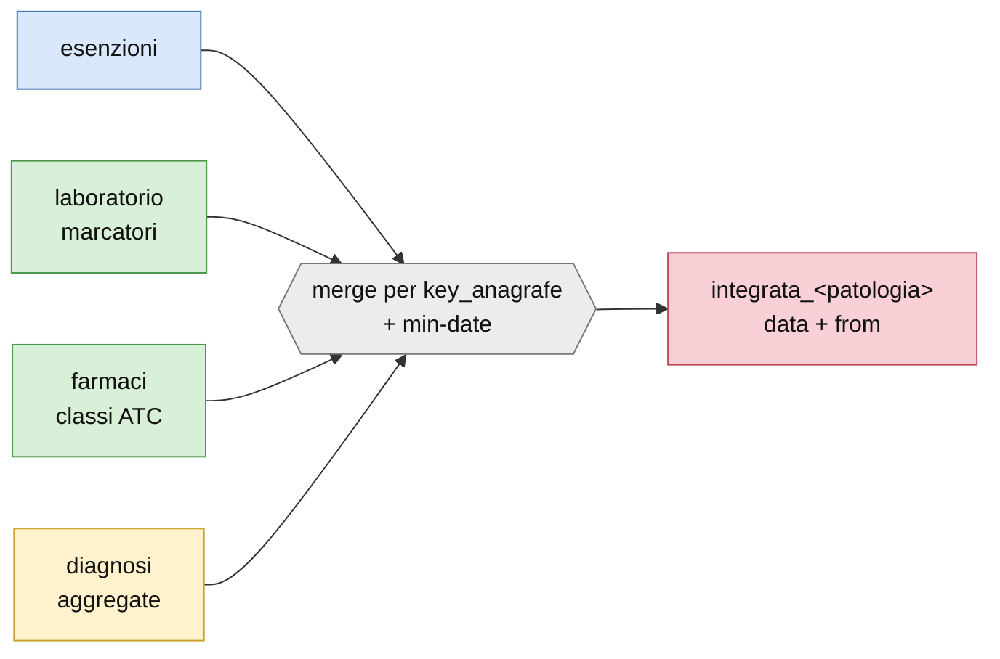

## Legenda dei colori (valida per tutti i diagrammi)

I diagrammi di questo documento usano una palette unica. Le **tabelle** sono
rettangoli/cilindri colorati per livello; le **trasformazioni** (DATA step / PROC)
sono esagoni grigi `{{…}}` con dentro la sintesi dei filtri; le **finestre temporali**
sono etichette sugli archi.

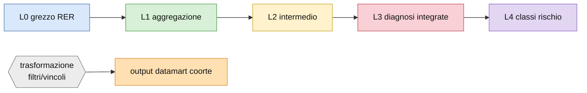

| Colore | Livello | Significato |
|---|---|---|
| azzurro | **L0** | grezzo RER (`DWTSISSR.v*`), semi del grafo |
| verde | **L1** | prima aggregazione (esami, classi ATC, SDO, cardionet) |
| giallo | **L2** | intermedio (diagnosi aggregate, laboratorio unito, eventi) |
| rosa | **L3** | diagnosi integrate (data minima tra fonti) |
| viola | **L4** | classi di rischio / score |
| grigio | trasf. | DATA step / PROC (esagono, con i filtri) |
| arancio | output | variabile finale nel datamart della coorte |

> **Convenzione nomi.** Nei diagrammi i nodi hanno nomi brevi e leggibili
> (`DNLAB`, `esami_acr`, `integrata_irc`), mai identificatori tecnici. I nomi
> coorte‑specifici sono scritti senza il prefisso `&nome.` (es. `integrata_irc`
> invece di `libout.&nome._integrata_irc`).

---

# Parte 1 — BUILDERS (L0 → L1 → L2)

Un **builder** trasforma il grezzo RER in tabelle di servizio riusabili da tutti gli
studi. A differenza del datamart, i builder **non dipendono dalla coorte**: producono
tabelle "master" (in `EGTASK`, `ESAMI`, `SDO`, `DIZ`) che la produzione poi taglia sulla
coorte specifica. I builder principali sono cinque, più i dizionari.

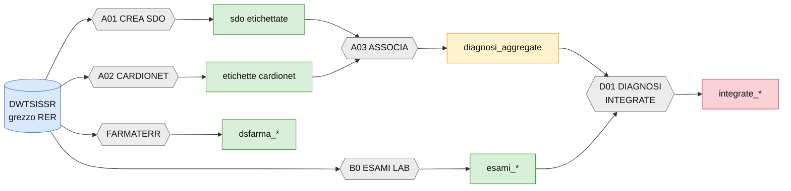

## SDO — ricoveri etichettati ICD‑9 (builder A01)

**Definizione.** Etichetta ogni ricovero (Scheda di Dimissione Ospedaliera) con le
categorie diagnostiche ICD‑9 rilevanti, secondo il dizionario `DIZIONARIO.xlsx`
(foglio ICD9).

**Fonti in ingresso.** `DWTSISSR.vfp_ricoveri_sdo_` (ricoveri, per anno),
`vanagrafe_dati_individuali`, e i dizionari SDO (`vdizionario_attributi_sdo`,
`vdizionario_drg`, `vdizionario_strutture`, `vdizionario_territorio`).

**Rami di elaborazione.** Ogni **etichetta** del dizionario è di due tipi:
- **pura** (`build=0`): una lista di codici ICD‑9, distinti in **diagnostici** (`D…`)
  e **interventi** (`I…`) — es. `ICD9_CM_BPCO = D490,D491,D492,D494,D496`. Il flag
  `DIAGNOSIN` decide se cercare il codice solo nella **prima** diagnosi del ricovero
  (`1`) o in **tutte e sei** (`6`).
- **derivata** (`build=1`): una regola logica su altre etichette interne (`zzz_*`) —
  es. `ICD9_CM_DM_NEUROPATIADM = 1 se (zzz_D2506 e zzz_NEUROPLUS)`. L'ordine di
  costruzione è dato dalla colonna `ORDER`.

**Output.** `egtask.sdo_generica` (ricoveri con tutte le colonne‑etichetta),
`egtask.sdo_etichettate`, e le versioni partizionate `sdo.sdo_single1..10` (per
parallelizzare l'etichettatura, che richiede ~6 ore non parallelizzata).

## Diagnosi C@rdioNet (builder A02)

**Definizione.** Classifica le diagnosi della cartella cardiologica C@rdioNet per
**descrizione, sede e gravità**.

**Fonti.** `DWTSISSR.vfp_cardio_diagnosi` (+ `vfp_cardio_visita` per l'aggancio
temporale). C@rdioNet è una monotabella senza chiavi esterne: l'unico legame è la
`key_anagrafe`; la data di prima apertura di una diagnosi è convenzionalmente
1/1/1900 (spesso riportata come 1/11/2009, entrata in servizio del sistema).

**Rami.** Ogni etichetta cardionet è un insieme di **triplette**
`descrizione / sede / gravità` (foglio CARDIO di `DIZIONARIO.xlsx`, colonne
`D1_A..D4_D`) — es. "OBESITÀ" con gradi lieve/moderato/severo.

**Output.** `egtask.etichette_cardionet` (diagnosi cardionet classificate).

## Diagnosi aggregate (builder A03 — associa ICD‑9 e cardionet)

**Definizione.** Unisce le etichette SDO (parte ricoveri) e le diagnosi C@rdioNet
(parte clinica) in un'unica **diagnosi aggregata** `diag_*` di livello L2. È il
passaggio che "chiude" una diagnosi da fonti amministrative + cliniche.

**Rami.** L'aggancio avviene per **lettera**: nel dizionario la cella
`ICD9_<X>*lettera` collega l'etichetta SDO alla colonna D della diagnosi cardionet
con quella lettera. Un'etichetta con flag `IN_ASSOCIAZIONE_CARDIO = 1` diventa una
diagnosi aggregata (le altre restano solo‑SDO). Le aggregate sono **110**
(es. `diag_CM_BPCO`, `diag_CM_IRC`, `diag_CM_DM`, `diag_CM_ANEMIA`).

**Output.** `egtask.diagnosi_aggregate` — l'input `EGTASK.DIAGNOSI_AGGREGATE`
citato da tutte le schede diagnosi del datamart.

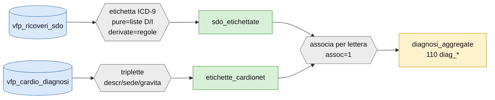

## Esami di laboratorio (builder B0 — CREA ESAMI LABORATORIO)

**Definizione.** Aggrega i molti codici DNLAB che identificano lo **stesso esame** in
una sola categoria (l'"esame"), unendo dove serve anche il laboratorio estratto da
C@rdioNet. Formalmente L1 (derivazione diretta da L0), ma alcuni esami subiscono
post‑processing (conversione unità, calcoli). Gli esami sono **38**.

**Fonti.** `DWTSISSR.vfp_dnlab_risultati_` (risultati per anno),
`vdizionario_dnlab_analisi` (mappa codice→esame), `vfp_cardio_esame_lab` (laboratorio
C@rdioNet).

**Rami.** Un loop **data‑driven** sul dizionario `ESAMI_LABORATORIO`: per ogni esame,
la macro `ACCODALAB(esame, annoi, annof, prefix)` accoda anno per anno i risultati,
filtrando `key_anagrafe ≠ 0`, l'esame richiesto e i risultati non mancanti
(`DATA_PRELIEVO = datepart(RISULTATI_DATA_PRELIEVO)`, righe distinte). Tre livelli di
lavorazione: aggregazione semplice; conversione di unità di misura (dataset omogeneo);
esami multi‑fase o già uniti al laboratorio C@rdioNet.

**Output.** `esami.esami_<esame>` (uno per esame) + il registro master `ESAMI.ESAMI`
(esame ↔ chiave analisi). I 38 esami includono:
`acr, aer, pcr, per, malbu, protu, creatinina, gfr, emoglobina, hbglicata, glicemia,
col, hdl, ldl, tri, bnp, probnp, albumina, calcio, fosforo, potassio, sodio, urea,
uricemia, ferritina, ferro, transferrina, got, gpt, tsh, troponinaHS, ematocrito, …`.

## Farmaceutica territoriale (builder FARMATERR)

**Definizione.** Codifica 1705 codici ATC in **62 classi** non mutuamente esclusive,
raggruppate per dimensione in **13 macro‑classi** (tabelle `DSFARMA_<ACRONIMO>`).

**Fonti.** Farmaceutica territoriale L0 (dal 1995, profondità massima, nessun filtro).

**Output.** `EGTASK.DSFARMA_ACP`, `_ACSGS`, `_AMA`, `_AIA`, `_AAA`, `_AS`, `_AAD`,
`_BPCO`, `_DIABETE`, `_DM1`, `_IPERTENSIONE`, `_IPOLIPEMIZZANTI`, `_SCC`. Colonne
in output (L1): `key_anagrafe, data_prestazione, CLASSE, farmaco, FARMACO_ATC_COD,
FARMAPRESCR_PEZZI, costo, FARMACI_DDD_GIORNI, copertura, anno_prestazione, …`.

> Dettaglio completo delle macro‑classi e delle colonne in
> [`OCVTS.md`](OCVTS.md) → sezione BUILDERS / FARMACEUTICA (già redatta).

## Dizionari costruiti (DIZIONARIO / DIZIONARII)

**Definizione.** Tabelle di reference L1 costruite dai builder e usate a valle
(selezioni, codifiche): `diz.selezione_prestazioni`, `diz.statine_dosaggi`,
`diz.tabella_codifica_esami`, `diz.ESAMI_LABORATORIO` (il dizionario che guida il
loop degli esami). Sono lette, mai prodotte dalla produzione.

## Builder delle diagnosi integrate (D01 — CREA DIAGNOSI_INTEGRATE)

**Definizione.** Versione "builder" (non coorte‑specifica) delle diagnosi integrate,
prodotta come tabella master in `EGTASK` per gli usi che non passano da una coorte ad
hoc: `egtask.diagnosi_integrate`, `integrate_bpco`, `integrate_diabetici`,
`integrate_rcvma`, `integrate_scc`. La logica di integrazione è la stessa della
Parte 2 (data minima tra fonti), applicata all'intera popolazione anziché alla coorte.

> ⚠︎ **Limite.** La maggior parte delle diagnosi integrate è costruita **solo per la
> coorte** (Parte 2): D01 materializza la versione master solo per alcune patologie.

---

# Parte 2 — DATAMART (folder PRODUZIONE)

Il datamart monta, **sulla coorte** di un singolo studio, le variabili finali
selezionate dal referente clinico tramite un foglio Excel (quali variabili tenere,
come rinominarle, in che ordine). Ogni unità di produzione (EGP) legge le tabelle
master dei builder + il grezzo RER e produce un output coorte‑specifico
`libout.&nome._<x>` (nei diagrammi: `<x>`).

Le sei famiglie: **DIAGNOSI**, **ESAMI**, **EVENTI**, **PRESTAZIONI**, **SCORE**,
**TERAPIA**.

# DIAGNOSI

Ogni scheda istanzia la **regola generale** della Parte 0: `merge` delle fonti per
`key_anagrafe`, `data_integrata_<x> = min(fonti)`, variabile `<x>_from`. L'output nel
datamart è tipicamente la coppia **`integrata_<x>`** (0/1) e **`data_integrata_<x>`**.
La sezione **BPCO** in [`OCVTS.md`](OCVTS.md) resta l'esempio esteso con tutti i
dataset intermedi (`temp_farma01`, rami anno/classe, esenzioni, SDO, merge finale).

## IRC — insufficienza renale cronica

**Definizione.** IRC integrata da esenzioni, dialisi, marcatori di laboratorio
(funzione renale e proteinuria) e diagnosi aggregate di ricovero.

**Fonti in ingresso.**
- **Esenzioni** (L0): `vfs_assistiti_esenti` + `vdizionario_esenzioni`, filtrate su
  `ESENZ_COD_ALPHA = "023"` e `ESENZ_COD_PATOL = "585"` → `data_esen`.
- **Dialisi** (L3): la diagnosi integrata di dialisi → `data_dialisi`.
- **Laboratorio** (L1): funzione renale e proteinuria, ciascuno in soglia **moderata**
  e **severa** (vedi sotto) → `lab_data_gfr_mod/sev`, `acr`, `pcr`, `aer`, `per`,
  `malbu`, `protu` (mod/sev).
- **Diagnosi aggregata** (L2): `diag_CM_IRC` / `diag_CM_RENALDIS` da
  `diagnosi_aggregate` → `data_diag`.

**Rami e filtri di laboratorio.**
- **GFR** stimato dalla creatinina con la formula **CKD‑EPI 2021**
  (per sesso: F usa 144/0.7, M 141/0.9, con esponenti dedicati e fattore `0.993^età`).
  Classi (`classe_gfr`): G1 ≥90, G2 60–89, G3a 45–59, G3b 30–44, G4 15–29, G5 0–14.
  `lab_gfr_moderato` = primo valore con GFR ≤ 60 **ripetuto** (secondo valore a
  distanza `gap ≤ Δgg ≤ 365`); `lab_gfr_severo` = primo con GFR ≤ 45.
- **Proteinuria** (ACR/AER/PCR/PER/MALBU/PROTU), classi per marcatore:
  ACR/AER `<30 / 30–299 / ≥300`; PCR/PER `<150 / 150–499 / ≥500`;
  MALBU `<2 / 2–19 / ≥20`; PROTU `<20 / 20–199 / ≥200` (moderata/severa).
  Le soglie sono lette **dal dizionario** `ESAMI_LABORATORIO` (colonne range).
- Gli esami sono agganciati alla coorte con `get_lab`: finestra
  `1JAN2005 ≤ data_prelievo ≤ data_fine_fup`, si tiene il valore **più vicino alla
  data indice**.

**Merge finale (regola).** `data_integrata_irc = min(` esenzione, diagnosi, dialisi,
gfr mod/sev, acr/pcr/aer/per/malbu/protu mod/sev `)`; `irc_from` registra la fonte
(`gfr_mod`, `esen`, `dialisi`, `diag`, `gfr_severo`, `sev_*`, `mod_*`);
`anno_irc = year(data_integrata_irc)`; soggetto affetto se `> 0`.

**Output.** `integrata_irc`, `data_integrata_irc` (nel datamart: foglio *INTEGRATA IRC*).

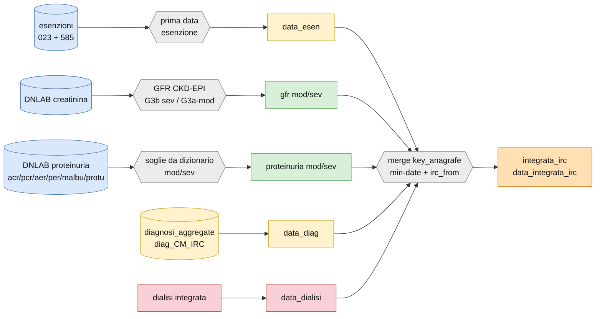

## DIABETE

**Definizione.** Diabete integrato da esenzione, emoglobina glicata, terapia
antidiabetica e diagnosi aggregata.

**Fonti.** Esenzione diabete (013) → `data_esen`; laboratorio **emoglobina glicata**
elevata → `data_lab`; farmaci **antidiabetici** (`dsfarma_diabete` / macro‑classe AMA)
→ `data_farma`; diagnosi aggregata `diag_CM_DM` → `data_diag`.

**Merge finale.** `data_integrata_diabete = min(esenzione, hbglicata, farmaci, diagnosi)`;
`diabete_from`.

**Classi di rischio del diabetico** (macro `%diabete`, a valle dell'integrazione):
`DMTOD` (danno d'organo: IRC, cardiopatia ischemica, neuro/retinopatia diabetica, PAD,
GFR<60, proteinuria); `DMSTOD` (severo: GFR<45, oppure 45–59 con proteinuria grado 1,
oppure proteinuria grado 2, oppure ≥3 tra proteinuria/GFR<60/retinopatia/neuropatia);
`DM10a` (durata ≥10 anni); classi finali *moderate / high / veryhigh*.

**Output.** `integrata_dm`, `data_integrata_dm` (foglio *INTEGRATA DM*).

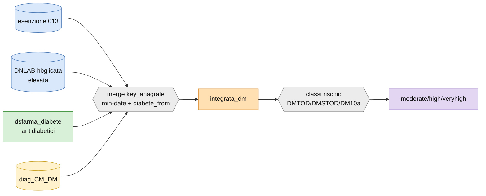

> ⚠︎ **Limite.** La macro `%diabete` cattura la classificazione del rischio; le soglie
> esatte di emoglobina glicata e i codici di esenzione/farmaci per l'integrazione sono
> inline nel flusso DIABETE e non tutti catturati staticamente.

## SCOMPENSO (SCC)

**Definizione.** Scompenso cardiaco cronico integrato da esenzione, terapia,
ricoveri (definizione PNE) e diagnosi C@rdioNet.

**Fonti.** Esenzione SCC → `data_esen`; farmaci `dsfarma_scc` → `data_farma`;
SDO scompenso (codici ICD‑9 PNE, via `diagnosi_aggregate`) → `data_diag`; cardionet.

**Merge finale.** `data_integrata_scc = min(fonti)`; `scc_from`.

**Output.** `integrata_scc`, `data_integrata_scc` (foglio *INTEGRATA SCC*).

> ⚠︎ **Limite.** La ricetta è inline (nessuna macro `integrata_scc` dedicata nel DB):
> codici e soglie esatti da leggere nel flusso `SCOMPENSO` / `SCCxPDTAL`.

## BPCO

**Definizione.** Broncopneumopatia cronica ostruttiva integrata da farmaci (rami anno
e classe), esenzioni, ricoveri (ICD‑9 asma/BPCO) e diagnosi aggregata.

Questa è la **scheda di riferimento estesa**: merge iniziale `temp_farma01`
(`dsfarma_bpco` × coorte, escl. classe OSSIGENO), rami paralleli *anno* (≥5 acquisti
in intervallo) e *classe* (≥3), più diagnosi/esenzioni/SDO, e merge finale
`integrata_bpco = min(fonti)` con `bpco_from`. **Dettaglio completo dei dataset
intermedi in [`OCVTS.md`](OCVTS.md) → DATAMART / DIAGNOSI / BPCO.**

**Output.** `integrata_bpco`, `data_integrata_bpco` (foglio *INTEGRATA BPCO*).

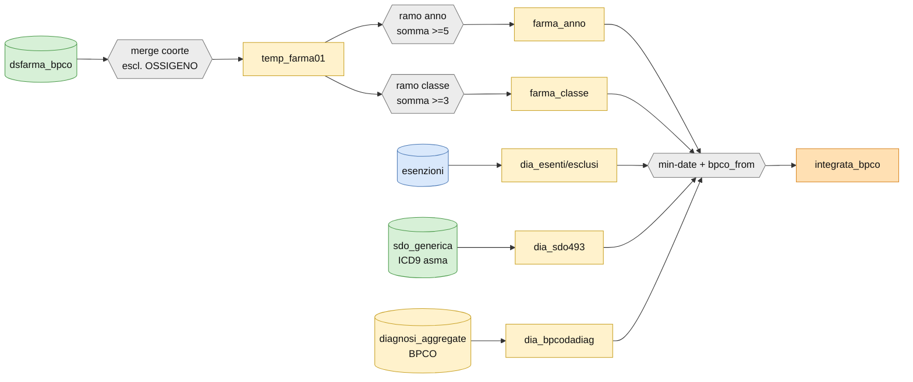

## FA — fibrillazione atriale

**Definizione.** FA integrata da esenzione, terapia anticoagulante, diagnosi
aggregata e C@rdioNet; il flusso materializza la coorte agganciando
`egtask.integrata_fa` alla coorte in ingresso.

**Fonti.** Esenzione FA; farmaci anticoagulanti; `diag_*` FA da ricovero; cardionet.

**Merge finale.** `data_integrata_fa = min(fonti)`; `fa_from`.

**Output.** `integrata_fa`, `data_integrata_fa` (foglio *INTEGRATA FA*).

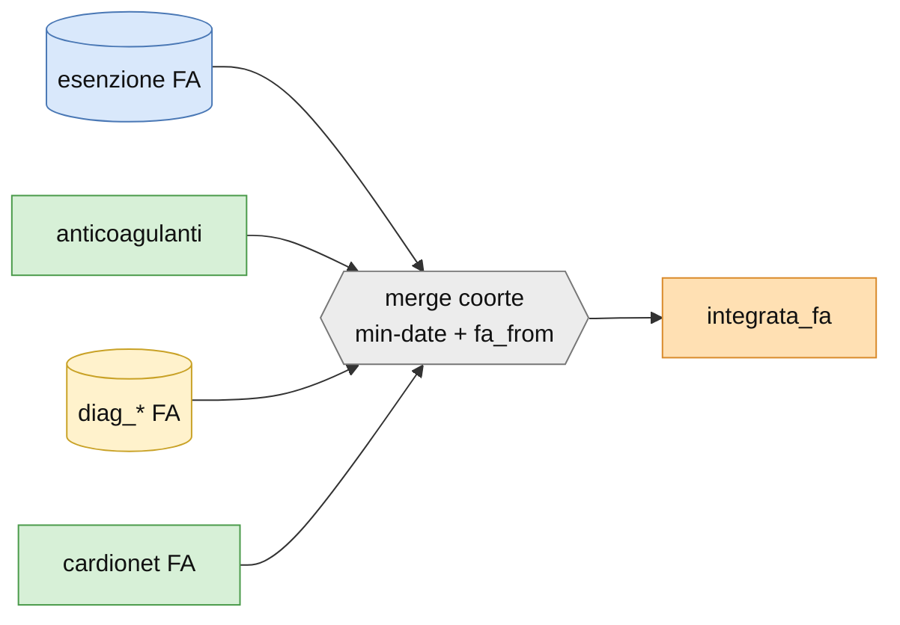

## COVID

**Definizione.** Infezione da SARS‑CoV‑2 integrata (macro `%accoda_covid`).
**Fonti.** Tamponi/segnalazioni COVID + eventuali ricoveri; `data_covid`.
**Output.** `integrata_covid`, `data_integrata_covid` (foglio *INTEGRATA COVID*,
variabili **non** trattenute di default → `tenere=0`).

> ⚠︎ **Limite.** Materiale scarso: nessuna versione L3 master, foglio datamart a 0
> variabili trattenute. La ricetta esatta (fonti/finestre) è inline nel flusso COVID.

## IPERTENSIONE

**Definizione.** Ipertensione arteriosa integrata da esenzione, terapia
antipertensiva, pressione (parametri funzionali C@rdioNet) e diagnosi.
**Fonti.** Esenzione ipertensione; farmaci `dsfarma_ipertensione`; `diag_*`;
pressione da C@rdioNet.
**Merge finale.** `data_integrata_ipertensione = min(fonti)`; `ipertensione_from`.
**Output.** `integrata_ipertensione`, `data_…` (foglio *INTEGRATA IPERTENSIONE*).

## DISLIPIDEMIA

**Definizione.** Dislipidemia integrata da esenzione, terapia ipolipemizzante e
marcatori lipidici (LDL/colesterolo).
**Fonti.** Esenzione; farmaci `dsfarma_ipolipemizzanti`; laboratorio `col`/`ldl`/`hdl`/`tri`.
**Output.** `integrata_dislipidemia`, `data_…` (foglio *INTEGRATA DISLIPIDEMIA*).

## ANEMIA

**Definizione.** Anemia integrata da emoglobina bassa, diagnosi aggregata e esenzione.
**Fonti.** Laboratorio **emoglobina** sotto soglia; `diag_CM_ANEMIA` (ICD‑9
`280–285`); esenzione.
**Output.** `integrata_anemia`, `data_…` (foglio *INTEGRATA ANEMIA*).

## Rischio CVMA

**Definizione.** Rischio cardiovascolare / malattia aterosclerotica — variabile di
livello **L4** costruita nel flusso CLASSI_RISCHIO, non una diagnosi da fonti L0.
**Output.** `integrata_rcvma`, `data_…` (foglio *INTEGRATA RCVMA*).

> ⚠︎ **Limite.** La catena non risale a L0 (parte da classi di rischio già calcolate):
> è un aggregato L4, non una diagnosi integrata nel senso della Parte 0.

## ipercol familiare

**Definizione.** Ipercolesterolemia familiare integrata: LDL molto elevato, terapia
(incl. PCSK9/inclisiran) e criteri clinici.
**Fonti.** Laboratorio `ldl` (valori molto elevati); farmaci ipolipemizzanti potenti;
diagnosi/esenzione.
**Output.** `integrata_ipercolfam`, `data_…` (foglio *INTEGRATA IPERCOL FAM*).

## microalbuminuria

**Definizione.** Microalbuminuria integrata dal marcatore urinario, con soglia
**dipendente dall'unità di misura** (macro `%microalb`):
`MG/24H ≥ 3`, `MG/DL ≥ 2`, `MG/L ≥ 20`, `MG/G ≥ 30` → `MICROALB = 1`.
**Fonti.** `esami.esami_microalbuminuria` (DNLAB).
**Output.** `integrata_microalbuminuria`, `data_…` (foglio *INTEGRATA MICROALBUMINURIA*).

## obesità

**Definizione.** Obesità integrata da BMI/antropometria (parametri funzionali
C@rdioNet: peso, altezza, circonferenza addominale) e diagnosi.
**Fonti.** Parametri funzionali; `diag_*` obesità; cardionet (gradi lieve/mod/severo).
**Output.** `integrata_obesita`, `data_…` (foglio *INTEGRATA OBESITA*).

## dialisi

**Definizione.** Dialisi integrata da esenzione, prestazioni ambulatoriali di dialisi
e ricoveri; **è anche una fonte dell'IRC** (`data_dialisi`).
**Fonti.** Esenzione dialisi; ambulatoriale L3 (dialisi); SDO dialisi.
**Output.** `integrata_dialisi`, `data_…`.

> ⚠︎ **Limite.** Non ha un foglio nel datamart (non è un flusso di output autonomo):
> serve come input all'IRC. Codici esatti nel flusso `INTEGRATA_DIALISI`.

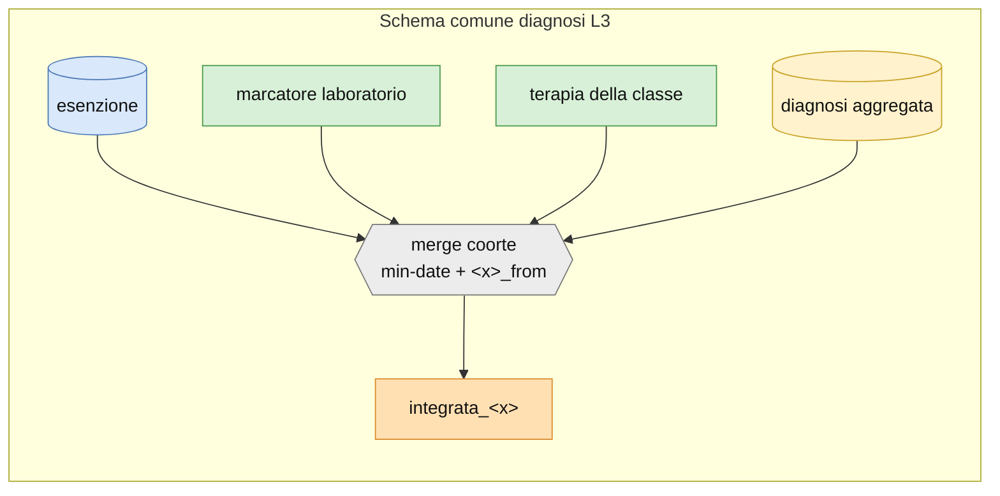

> Il diagramma sopra vale per IPERTENSIONE, DISLIPIDEMIA, ANEMIA, ipercol familiare,
> obesità, dialisi: cambiano le fonti concrete (marcatore, classe farmaci, codici
> diagnosi), non lo schema.

# ESAMI

## LABORATORIO

**Definizione.** Aggancia alla coorte gli esami di laboratorio costruiti dal builder
B0, tenendo il valore **più vicino alla data indice**. Non ri‑aggrega i codici (già
fatto in L1): seleziona, per persona ed esame, il valore rilevante e ne deriva
indicatori (es. GFR, classi).

**Fonti.** `esami.esami_<esame>` (L1) × coorte; per il GFR anche la creatinina.

**Rami e filtri.** Per ogni esame la macro `get_lab(etichetta)` fa l'inner join con la
coorte, filtra `1JAN2005 ≤ data_prelievo ≤ data_fine_fup` e risultato non mancante,
calcola la distanza dalla data indice (`DISTGG`) e il posizionamento (`IPP`: stesso
giorno / prima / dopo), e tiene il **primo** per prossimità alla data indice.

**Output (14 variabili trattenute su 38).** `GFR_CKDEPI`, `GFR_BIS1`, `LAB_ACR`,
`LAB_AER`, `LAB_ALBUMINA`, `LAB_BNP`, `LAB_COL`, `LAB_CRCL`, `LAB_CREATININA`,
`LAB_EMOGLOBINA`, `LAB_GLICEMIA`, `LAB_HBGLICATA`, `LAB_HDL`, `LAB_LDL`
(foglio *LABORATORIO*). Gli altri 24 esami (PCR, PER, MALBU, PROTU, elettroliti,
funzione epatica, ferro, TSH, troponina, …) sono calcolati ma non trattenuti di default.

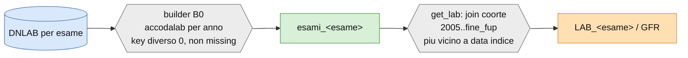

## ECO / ECG

**Definizione.** Esami strumentali cardiologici estratti da C@rdioNet: ecocardiografia
(ECO) ed elettrocardiografia (ECG), agganciati alla coorte.
**Fonti.** `DWTSISSR.vfp_cardio_eco`, `vfp_cardio_ecg_mortara`.
**Output.** `&nome._eco` (foglio *ECO*, 113 variabili), `&nome._ecg` (foglio *ECG*, 17).

> ⚠︎ **Limite.** Nessuna macro dedicata catturata: la selezione di misure/variabili è
> inline nel flusso ECO/ECG; foglio datamart con `tenere=0` (selezione per studio).

## spirometrie

**Definizione.** Spirometrie da ambulatoriale e prestazioni sanitarie.
**Fonti.** `vfp_ambulatoriale_prestaz_`, `vdizionario_prestazioni` (macro
`accoda_spiroamb` / `accoda_spirosan` / `accoda_anni_spyro`).
**Output.** `&nome._spirometrie` (foglio *SPIROMETRIE*).

## fenotipo

**Definizione.** Fenotipizzazione morfologica cardiaca da C@rdioNet.
**Fonti.** `vfp_cardio_eco`, `vfp_cardio_eco_morfologica`.
**Output.** `&nome._fenotipo` (foglio *FENOTIPO*, 8 variabili).

## par. funzionali

**Definizione.** Parametri funzionali/clinici da C@rdioNet (pressione, frequenza,
antropometria, classe NYHA, saturazione, INR).
**Fonti.** `vfp_cardio_paramfunz`.
**Output (10 trattenute su 574).** `PAS`, `PAD`, `FC`, `SO2`, `PESO`, `ALTEZZA`,
`CIRC. ADD.`, `CLASSE NYHA`→`nyha`, `TTR(INR)` (foglio *PARAMETRI FUNZIONALI*).

> ⚠︎ **Limite.** 574 variabili grezze, ricetta di selezione non in una macro dedicata.

# EVENTI

Gli eventi combinano fonti L1 e L0 in eventi complessi; la data è tipicamente la
**minima** tra gli eventi elementari.

## MALE

**Definizione.** Major Adverse Limb Event.
**Output.** `male` (0/1), `data_male`, `distmale` (foglio *MALE*).

## MACE 3p / 5p

**Definizione.** Major Adverse Cardiovascular Event a 3 e 5 punti; `data_mace3` =
minima tra decesso, infarto e stroke (5p aggiunge ulteriori componenti).
**Output.** `mace3`, `mace5`, `data_mace3`, `data_mace5`, `dist3pi`, `dist5pi`
(foglio *MACE 3P 5P*).

## eventi ricovero

**Definizione.** Eventi di ospedalizzazione classificati (CV/non‑CV, per apparato).
**Fonti.** SDO (`SDO_EVENTI`).
**Output (10 trattenute su 173).** `EVENT_RIC_CV`, `EVENT_RIC_NONCV`, `EVENT_CM_IRC`,
`EVENT_CH_RENALDIS`, `EVENT_FR_DIALISI`, `EVENT_INT_TRAPRENE`, `EVENT_CV_SCCPNE_EVENTO`,
`EVENT_VD_VALVOLE_GEN/TOT`, `EVENT_ASCVD_MULTISITE` (foglio *EVENTI OSPEDALIZZAZIONI*).

## emorragie maggiori

**Definizione.** Emorragie maggiori (macro `accoda_emod`), distinte per tipo.
**Output.** `emomag_a`, `emomag_f`, `data_emomag_a`, `data_emomag_f`
(foglio *EMORAGGIE MAGGIORI*).

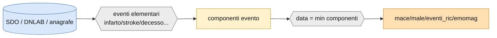

# PRESTAZIONI

Le prestazioni accodano, per la coorte, le erogazioni dal CUP (prenotazioni), da
C@rdioNet e dal Pronto Soccorso, con conteggi per anno. Schema comune: macro
`accodacupprest` (prestazioni) + `accodacupstrut` (strutture), filtri per tipo
prestazione, output `&nome._prestazioni_<tipo>`.

| Sezione | Fonte principale | Output coorte |
|---|---|---|
| CUP altro | `vfp_cup_prestsan_`, `vdizionario_cup_prestsan` | `prestazioni_altro` |
| CUP ecg | CUP (filtro ECG) | `prestazioni_ecg` |
| CUP eco | CUP (filtro ECO) | `prestazioni_eco` |
| CUP ecovasco | CUP (filtro ecovascolare) | `prestazioni_ecov` |
| CUP ecocardio | CUP (filtro ecocardio) | `prestazioni_ecoc` |
| CUP tutte | CUP (tutte le prestazioni) | `prestazioni_tutte` |
| CUP spiro | ambulatoriale/CUP (spirometria) | `prestazioni_spiro` |
| CUP visite | CUP (visite) | `prestazioni_visite` |
| prest Cardionet | `vfp_cardio_visita` | `prestazioni_cardionet` |
| pronto soccorso | `vfp_ps_episodi_` | `pronto_soccorso` |

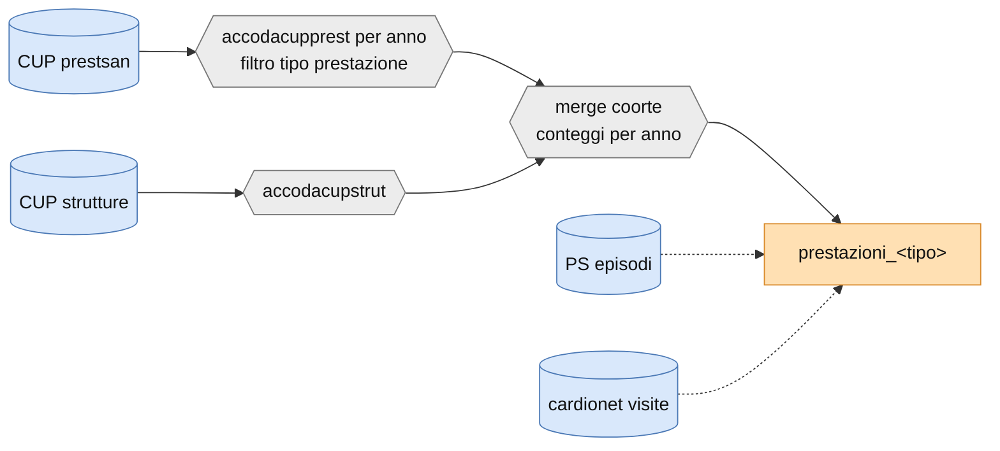

> ⚠︎ **Limite.** Nessuna delle prestazioni ha un foglio nel datamart: la lista
> variabili di output va letta dalle colonne del dataset prodotto
> (`grafo.py columns CLINICO.COORTE_PRESTAZIONI_<tipo>`), non da una specifica autorevole.

# SCORE

Cinque unità di produzione hanno `type=score` nel registro `riferimenti.xlsx`:
**CHARLSON_SCORE**, **ESCSCORE**, **SCORE2**, **SCOREC** e **CLASSI_RISCHIO** (che le
aggrega). SCORE2 e SCOREC dipendono da `idm` (diabete integrato); CLASSI_RISCHIO
dipende da `iir, icf, ids, iip, iob, idm, sc2`.

## score2 / score2op

**Definizione.** SCORE2 / SCORE2‑OP (rischio CV a 10 anni), calcolato da età, sesso,
pressione, colesterolo, fumo, diabete (macro `score` / `scoreval`).
**Fonti.** Parametri (età/sesso/pressione), laboratorio (colesterolo), diabete
integrato.
**Output.** `&nome._score2` (+ `daichi_score2`); nel datamart flat: `SCORE2`,
`risk_class_score2`, `flag_missing_score2`.
> ⚠︎ **Limite.** Nessun foglio nel DATAMART‑BUILDER: le variabili si leggono dalle
> colonne del dataset prodotto / dal datamart flat dello studio.

## SCOREC

**Definizione.** Variante **ricalibrata** di SCORE2 (rischio cardiovascolare a 10 anni),
prodotta dall'EGP `SCOREC` (flow `SCORECAL`). Registrata in `riferimenti.xlsx` come
`scc` (`type=score`, `dependencies=idm`, attiva su CLINICO/PDTA/EPI4M).

**Fonti / variabili in ingresso.** `age`, `gender`, pressione sistolica `pas`,
colesterolo totale `col`, `hdl`, `fumo`, `diabete` (dal diabete integrato). Se manca
uno tra età/pressione/colesterolo/HDL → `SCOREC = .`.

**Calcolo (regola).** Modello di sopravvivenza tipo SCORE2 con coefficienti
**specifici per sesso** (`b1..b11`), baseline `s0` e centrature standard
(età −60/5, pressione −120/20, colesterolo −6, HDL −1.3/0.5); il rischio grezzo
`1 − s0^exp(predittore lineare)` è poi **ricalibrato** con la trasformazione
`scale1 + scale2·log(−log(1−rischio))` (parametri di calibrazione per sesso).
Risultato espresso in percentuale (`SCOREC × 100`).

**Output.** `&nome._scoreC` → nel datamart flat: `SCOREC`, `risk_class_scorec`,
`flag_missing_scorec` (paralleli a SCORE2). Già ingerito nel grafo: EGP `SCOREC`,
flow `SCORECAL`, output L4 `CLINICO.COORTE_SCOREC`.

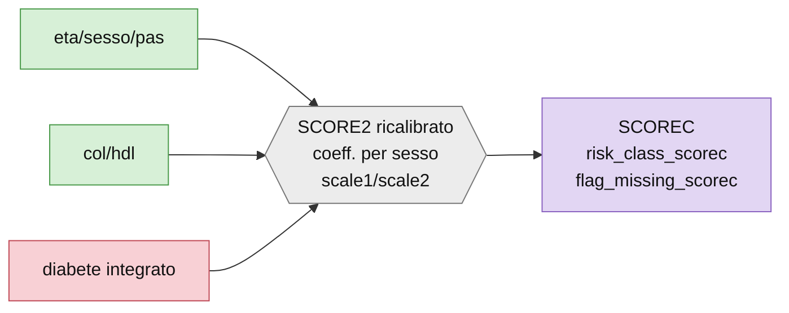

## Charlson

**Definizione.** Charlson Comorbidity Index dai ricoveri/diagnosi.
**Output.** `&nome._charlson_score` (foglio *CHARLSON SCORE*, 1 variabile).

## ESC

**Definizione.** ESC risk score.
**Output.** `&nome._escscore` (foglio *ESC SCORE*, 1 variabile).

## classi di rischio cardiovascolare (L4)

**Definizione.** Classificazione finale del rischio CV (CLRCV), che combina diagnosi
integrate, laboratorio e parametri. Prodotta in CLASSI_RISCHIO.
**Output.** `&nome._classi_rischio` (+ le `integrata_*` per diagnosi).
> ⚠︎ **Limite.** Nessun foglio datamart; è il nodo L4 a valle di gran parte delle
> diagnosi integrate.

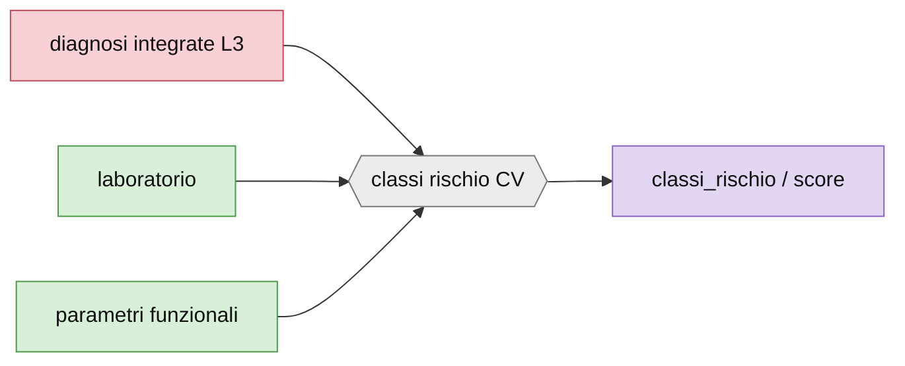

# TERAPIA

## farmaceutica territoriale

**Definizione.** Terapia farmaceutica territoriale agganciata alla coorte, con
finestre temporali **diverse per protocollo** e indicatori di potenza/aderenza.
Costruita sopra le macro‑classi `dsfarma_*` (builder FARMATERR).

**Filtri per protocollo** (finestra rispetto alla data indice/uscita):
- **CLINICO:** `data_indice − 90 ≤ data_prescrizione ≤ data_indice + 180`.
  Output: potenza ipolipemizzanti (indice e follow‑up, incl. PCSK9/inclisiran), somma
  prescrizioni a 6/12 mesi per classe, flag classe follow‑up 6 mesi / anamnesi 3 mesi.
- **PDTA:** `data_uscita_indice ≤ data_prescrizione ≤ data_uscita_indice + 730`.
  Output: somma copertura annua per classe, flag 0/1 di classe, `last_AA/ASA/NAOTAO`,
  somma ATC per persona.
- **EPI4M:** `data_indice ≤ data_prescrizione ≤ data_indice + 365`.
  Output: potenza ipolipemizzanti (indice `−365..0`, fup `+270..+360`), somma grezza ATC.

**Output.** `&nome._farmaceutica` (foglio *FARMACEUTICA*; tra le trattenute: `PCSK9I`,
`INCLISIRAN`). Testo dei tre protocolli già presente in [`OCVTS.md`](OCVTS.md).

## cardio farma (terapia C@rdioNet)

**Definizione.** Terapia registrata in C@rdioNet, aggregata in classi cardiologiche.
**Fonti.** `vfp_cardio_terapia`, `vdizionario_farmaci_atc`, `vdizionario_farmaci_sost`.
**Output (40 trattenute su 190).** per ciascuna classe (ACEI/sartani, Betabloccanti,
antiaggreganti, anticoagulanti, antidiabetici, calcio‑antagonisti, diuretici,
ipolipemizzanti) le 5 colonne `<classe>`, `_ATCCOD`, `_CONF`, `_QTA`, `_SOST`
(foglio *TERAPIA CARDIONET*).

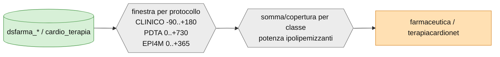

---

## Due viste del datamart

Il datamart ha due rappresentazioni complementari, entrambe autorevoli:
- **`DATAMART-BUILDER.xlsx`** — la **specifica di selezione**, un foglio per flusso,
  colonna `TENERE`: dichiara *quali* variabili l'assembler deve trattenere.
- **`DATAMART_DAICHI-*.xlsx`** — il **datamart finale "flat"** di uno studio concreto
  (daichi): un unico foglio con le colonne effettivamente consegnate. È il **modello**
  di come appare l'output. Contiene già le variabili SCOREC (`SCOREC`,
  `risk_class_scorec`, `flag_missing_scorec`) accanto a quelle SCORE2, a conferma che
  l'EGP `SCOREC` è in produzione.

## Note di copertura

Ricostruzione **statica** dalla pipeline di lineage (nessun accesso al server SAS).
Robusto dove esiste una macro o un foglio datamart autorevole (IRC, laboratorio,
eventi, terapia cardionet, diagnosi aggregate); **best‑effort con nota ⚠︎** dove la
ricetta è inline o priva di specifica datamart (prestazioni CUP, score2op, strumentali,
COVID, RCVMA). Le liste variabili di output combaciano con i fogli
`DATAMART-BUILDER.xlsx`; i filtri/soglie con i corpi macro citati.

